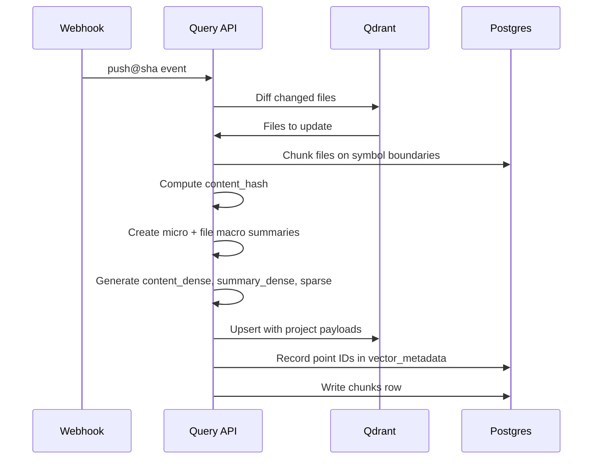
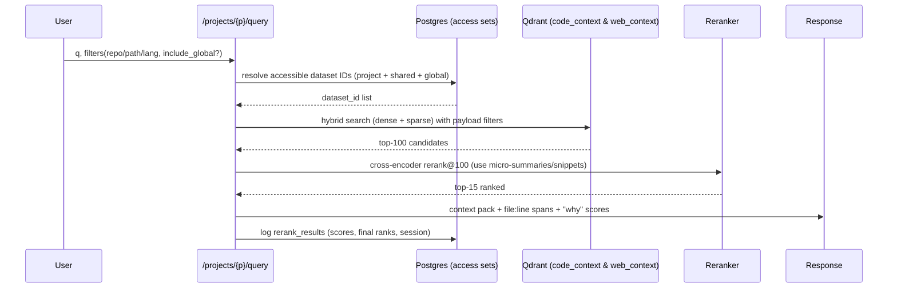
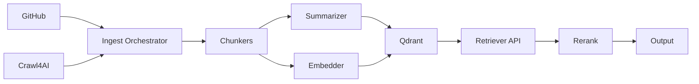

# Combined Files from plan

*Generated on: Thu Nov  6 09:52:37 AM EST 2025*

---

## File: 01-architecture.md

**Path:** `01-architecture.md`

```markdown
# Architecture

## High-level Dataflow

```mermaid
flowchart LR
  subgraph GH[GitHub]
    GH0[Webhook: push@sha]
  end

  subgraph C4AI[Crawl4AI]
    C0[seed URL(s)]
  end

  GH0 --> I[Ingest Orchestrator]
  C0 --> I

  I --> CK[Chunkers]
  CK --> SUM[Summarizer (micro + macro)]
  CK --> EMB[Embedder: dense + sparse + summary]
  SUM --> Q[Qdrant: named vectors + sparse]
  EMB --> Q
  CK --> O[(Object Store):::store]  %% macros, blobs
  SUM --> O

  I --> PG[(Postgres Orchestrator DB)]
  Q --> R[Retriever API]
  PG --> R

  R --> H[Hybrid Search (dense+sparse)]
  H --> RE[Cross-Encoder Rerank]
  RE --> CP[Context Pack + Evidence]
  CP --> OUT[(Answer + Snippets + Why)]

  classDef store fill:#f5f5f5,stroke:#999,color:#333
```

## Project Isolation & Sharing

Each **Project** is its own "knowledge island," with optional bridges for shared/global content.

```mermaid
graph TD
  P1[Project A] -->|owns| D1[Datasets A*]
  P2[Project B] -->|owns| D2[Datasets B*]
  G[Global]:::g -->|is_global| Dg[Global Datasets]
  P1 -. shares via project_shares .-> D2
  P2 -. shares via project_shares .-> D1
  P1 -->|query filter| Q[(Qdrant points with payload.project_id in {A} ∪ shared ∪ global)]
  classDef g fill:#eef8ff,stroke:#3b82f6,color:#1e3a8a
```

## Component Map

```mermaid
graph LR
  subgraph Ingestion
    W[Webhook Receiver]
    GIX[Git Indexer]
    CIX[Crawl4AI Worker]
    CH[Chunkers (AST/Docs)]
    SM[Summarizer]
    EM[Embedder]
  end

  subgraph Storage
    PG[(Postgres: projects, datasets, web_pages, chunks, vector_metadata, rerank_results)]
    QD[(Qdrant: code_context, web_context)]
    OS[(Object Store: macros, blobs)]
  end

  subgraph API
    QRY[/Query API/]
    ADM[/Admin API/]
  end

  W-->GIX-->CH-->SM-->EM-->QD
  CIX-->CH
  CH-->PG
  SM-->OS
  QRY-->PG
  QRY-->QD
  QRY-->OS
  ADM-->PG
```

## Why This Works

- **Dual-vector chunks + Qdrant metadata:** Already track `summary_vector_id`, store vector IDs and payload snapshots in **`vector_metadata`**, and log rerank scores in **`rerank_results`**
- **Crawl4AI integration:** `web_pages`, `crawl_sessions`, views for monitoring, and helper functions in place
- **Project isolation:** **`projects`**, `project_id` on datasets, **`is_global` flags**, **`project_shares`**, and **views** (`project_statistics`, updated `dataset_statistics`)

```

---

## File: 02-data-model.md

**Path:** `02-data-model.md`

```markdown
# Data Model

## Qdrant Collections

### Collections
- `code_context` - GitHub code chunks
- `web_context` - Web page chunks

### Named Vectors
- `content_dense` - Main embedding (768/1024 dimensions)
- `summary_dense` - Embedding of micro-summary (≤256 tokens)
- `sparse` - BM25/SPLADE-like CSR payload for lexical boost

### Payload (Minimal, Fast-Filtering)
```json
{
  "project_id": "uuid",
  "dataset_id": "uuid",
  "source_type": "code|web_page|doc",
  "provenance": {
    "repo": "string",
    "branch": "string",
    "sha": "string",
    "relpath": "string",
    "lang": "string"
  },
  "OR": {
    "url": "string",
    "domain": "string"
  },
  "chunk_index": "int",
  "symbol": "jsonb",
  "summary_256": "string"
}
```

## Postgres Source of Truth

### Key Tables

**`chunks`**
- Already stores `content_vector_id`, `summary_vector_id`
- Links chunks to vector representations in Qdrant
- Has unique constraints per document/page
- Includes: `repo`, `branch`, `sha`, `relpath`, `lang`, `symbol`, `content_hash`

**`vector_metadata`**
- Model information, dimensions, payload snapshots
- Rerank scores
- Links to Qdrant point IDs
- Indexed by `vector_type`/`collection_name`

**`rerank_results`**
- Query text, vector/BM25/rerank scores
- Final ranks and session IDs
- For evaluation and monitoring

**`web_pages`**
- Content + metadata
- Links to crawl sessions

**`crawl_sessions`**
- Track jobs and metrics

### Project Isolation

**`projects`**
- Owns datasets
- Default projects: `default`, `global`

**`project_shares`**
- Explicit sharing between projects
- Audit metadata

**`project_statistics`, `dataset_statistics`, `crawl_session_summary`**
- Monitoring views
- Ingest coverage and crawl health

### Indexes

- `(repo, sha)`, `(relpath)`, `(lang)`
- Unique: `(document_id|web_page_id, chunk_index, content_hash)`

## Object Store

- **Macro summaries** per file and per repo
- Large blobs
- Referenced in DB payloads

```

---

## File: 03-pipelines.md

**Path:** `03-pipelines.md`

```markdown
# Pipelines

## GitHub Ingest (Diff-First)



**Steps:**
1. **Webhook** `push@sha` → enqueue `repo.index@sha`
2. **Diff** changed files
3. **Chunk** (tree-sitter/ctags) on **symbol boundaries**; compute `content_hash`
4. **Summarize**: micro (≤256 tok) + file macro (store macro in object store, link in payload/DB)
5. **Embed**: `content_dense`, `summary_dense`, plus **sparse terms**
6. **Upsert** to Qdrant with **project payloads**; record point IDs in **`vector_metadata`**
7. **Write** `chunks` row with `vector_id`, `summary_vector_id`

## Crawl4AI Ingest (Project-Aware)

**Steps:**
1. Use **`web_pages`** for content + metadata
2. Use **`crawl_sessions`** to track jobs and metrics
3. Upsert pages via **`upsert_web_page_v3(project, dataset, ...)`** helper
   - Auto-creates project/dataset if needed
   - Attaches to correct project
4. Chunk → summarize → embed → upsert to Qdrant
5. Write vector IDs to **`vector_metadata`** and chunks to **`chunks`**

## Event Bus (Bi-directional Async)

Each stage emits events:
- `file.changed`
- `chunk.created`
- `chunk.summarized`
- `vector.upserted`
- `crawl.completed`
- `query.issued`
- `rerank.logged`

**Idempotency keys:** `source:sha:relpath:chunk_index:content_hash`

Use session IDs for traceability (already in schema).

```

---

## File: 04-retrieval.md

**Path:** `04-retrieval.md`

```markdown
# Retrieval Algorithm

## Sequence Diagram



## Algorithm Steps

1. **Access Resolution**
   - Expand to: *this project* ∪ *explicit shares* ∪ *global content*
   - Uses `is_global` flags + `project_shares`
   - SQL: `accessible_dataset_ids = {project_id} ∪ {datasets with is_global} ∪ {datasets shared via project_shares}`

2. **Hybrid Search (Dense + Sparse)**
   - Query Qdrant with payload filters
   - `must`: `dataset_id ∈ accessible_dataset_ids`
   - Optional: `repo/path/lang` filters
   - Retrieve top-100 candidates

3. **Cross-Encoder Rerank**
   - Rerank top-100 using micro-summaries/snippets
   - Output top-15 ranked results

4. **Context Packing**
   - Macro-aware: merge adjacent spans
   - Include macro once when multiple chunks from same file
   - Return "why" evidence (scores + file:line spans + project/dataset IDs)

5. **Logging**
   - Persist scores & ranks to **`rerank_results`**
   - Track `search_session_id` for grouped analysis
   - Enables MRR/nDCG computation

## Filters & Access

**Project Visibility Enforcement:**
1. SQL first: resolve accessible `dataset_id` set
2. Pass **only those IDs** into Qdrant filters
3. Re-check access using **`is_resource_accessible(project, type, id)`** before returning context

**Global Content:**
- Keep in `global` project
- Queryable everywhere via `is_global` flag
- Share tactical datasets via **`project_shares`**

```

---

## File: 05-api.md

**Path:** `05-api.md`

```markdown
# API Specification

## Endpoints

### Ingestion

**POST `/projects/{name}/ingest/github`**
```json
{
  "repo": "string",
  "sha": "string",
  "branch": "string"
}
```
- Triggers GitHub webhook processing
- Uses `get_or_create_project` to resolve project

**POST `/projects/{name}/ingest/crawl`**
```json
{
  "start_url": "string",
  "crawl_type": "string",
  "depth": "number",
  "max_pages": "number",
  "dataset": "string"
}
```
- Initiates Crawl4AI job
- Tracked in **`crawl_sessions`**

### Query

**POST `/projects/{name}/query`**
```json
{
  "q": "string",
  "repo": "string?",
  "path_prefix": "string?",
  "lang": "string?",
  "include_global": "boolean",
  "k": "number"
}
```
Returns:
```json
{
  "results": [
    {
      "chunk": "string",
      "file": "string",
      "line_span": {
        "start": "number",
        "end": "number"
      },
      "scores": {
        "vector": "number",
        "sparse": "number",
        "rerank": "number",
        "final": "number"
      },
      "project_id": "uuid",
      "dataset_id": "uuid"
    }
  ],
  "evidence": "string"
}
```

### Administration

**POST `/projects/{from}/share`**
```json
{
  "to_project": "string",
  "resource_type": "dataset|web_page|document",
  "resource_id": "uuid",
  "expires_at": "datetime?"
}
```
- Calls **`share_resource`** to expose datasets/docs/pages to another project
- Includes audit metadata

**GET `/projects/{name}/stats`**
```json
{
  "datasets": "number",
  "chunks": "number",
  "web_pages": "number",
  "crawl_sessions": [
    {
      "id": "uuid",
      "status": "string",
      "pages_crawled": "number",
      "pages_failed": "number",
      "duration_ms": "number"
    }
  ]
}
```
- Joins **`project_statistics`**, `dataset_statistics`, and `crawl_session_summary`

```

---

## File: 06-milestones.md

**Path:** `06-milestones.md`

```markdown
# Milestones - Phased Implementation

## Phase A — Project-aware Ingest & Storage (2–3 days)

### Deliverables
- [ ] Wire ingest endpoints to require `project` name
- [ ] Use **`get_or_create_project`** to create/resolve project on write paths
- [ ] Crawl4AI: switch to **`upsert_web_page_v3(project, dataset, …)`**
- [ ] Verify new pages appear in **`web_pages`** with correct project/dataset
- [ ] GitHub indexer: tag chunks with `project_id` (via dataset)
- [ ] Add provenance columns (`repo`, `branch`, `sha`, `relpath`, `lang`, `symbol`)
- [ ] Metrics: `project_statistics` shows datasets/pages/chunks by project

### Exit Criteria
✅ Project-scoped data visible in stats views
✅ Old queries work with project default

---

## Phase B — Qdrant Collections & Hybrid Search (2 days)

### Deliverables
- [ ] Create `code_context` & `web_context` with **named vectors + sparse**
- [ ] Upsert content+summary+sparse vectors
- [ ] Write **`vector_metadata`** rows for each vector
- [ ] Implement hybrid search (dense + sparse)
- [ ] Payload filters for accessible set (project ∪ shares ∪ global)

### Exit Criteria
✅ `/projects/{p}/query` returns top-100 candidates
✅ Consistent filters across all projects

---

## Phase C — Rerank + Context Packing (1–2 days)

### Deliverables
- [ ] Add cross-encoder rerank@100
- [ ] Log **`rerank_results`** (query text, vector/bm25/rerank scores, final ranks)
- [ ] Implement macro-aware context packing
  - Merge adjacent spans
  - Include macro once when multiple chunks from same file
- [ ] Return "**why**" evidence
  - Scores + file:line spans + project/dataset IDs

### Exit Criteria
✅ Measurable MRR uplift (>+15%) on gold set
✅ p95 latency stays under target

---

## Phase D — Crawl Observability & Sharing UX (1 day)

### Deliverables
- [ ] Surface **`crawl_session_summary`** to UI
- [ ] Show success rate/durations per project
- [ ] Implement `/projects/{from}/share` using `share_resource`
- [ ] Add audit metadata

### Exit Criteria
✅ Admins can share datasets across projects
✅ Crawl sessions monitored per project

---

## Phase E — Hardening & Evaluation (Ongoing)

### Deliverables
- [ ] Nightly snapshot/restore drills
- [ ] Expand gold query set (50→100 queries)
- [ ] Track MRR/nDCG weekly from **`rerank_results`**
- [ ] Optional: Add **graph-lite adjacency table** (callers/imports)
  - Nudge scores
  - Graduate to Neo4j later if needed

### Exit Criteria
✅ DR procedures tested and documented
✅ Weekly quality metrics tracking in place

---

## Success Metrics & Expected Deltas

| Metric | Current | Target | Improvement |
|--------|---------|--------|-------------|
| **Search Latency (Top-100)** | Baseline | 1.5–4× faster | ~300% |
| **End-to-End Latency** | Baseline | ~2× faster | ~100% |
| **MRR@10** | Baseline | +15–35% improvement | Quality uplift |
| **nDCG@10** | Baseline | +15–35% improvement | Quality uplift |
| **Cross-Project Isolation** | N/A | Zero leakage | Security |

## Phasing Rationale

- **Phase A-B**: Core infrastructure (project isolation + search)
- **Phase C**: Quality improvements (reranking + context packing)
- **Phase D**: Operations (monitoring + sharing)
- **Phase E**: Long-term hardening and evaluation

```

---

## File: 07-implementation.md

**Path:** `07-implementation.md`

```markdown
# Implementation Notes

## Project Filter Resolver (SQL)

```sql
-- Build accessible_dataset_ids
WITH
  project_datasets AS (
    SELECT dataset_id
    FROM datasets
    WHERE project_id = $1
  ),
  global_datasets AS (
    SELECT dataset_id
    FROM datasets
    WHERE is_global = true
  ),
  shared_datasets AS (
    SELECT resource_id as dataset_id
    FROM project_shares
    WHERE from_project_id = $1
      AND resource_type = 'dataset'
      AND (expires_at IS NULL OR expires_at > NOW())
  )
SELECT dataset_id
FROM (
  SELECT dataset_id FROM project_datasets
  UNION
  SELECT dataset_id FROM global_datasets
  UNION
  SELECT dataset_id FROM shared_datasets
) accessible;
```

## Qdrant Filter

```json
{
  "must": [
    { "key": "dataset_id", "match": { "any": [list_of_ids] } }
  ],
  "should": [
    { "key": "repo", "match": { "value": "repo_name" } },
    { "key": "lang", "match": { "value": "language" } }
  ]
}
```

## Rerank Logging

```sql
INSERT INTO rerank_results (
  search_session_id,
  query_text,
  candidate_rank,
  candidate_id,
  vector_score,
  sparse_score,
  rerank_score,
  final_rank,
  project_id,
  created_at
) VALUES (
  $1, $2, $3, $4, $5, $6, $7, $8, $9, NOW()
);
```

## Crawl Health Monitoring

From `crawl_sessions`:
- `status`: running|completed|failed
- `pages_crawled`: success count
- `pages_failed`: error count
- `duration_ms`: total time

Dashboard queries:
```sql
-- Success rate by project
SELECT
  p.name,
  COUNT(*) FILTER (WHERE cs.status = 'completed') * 100.0 / COUNT(*) as success_rate,
  AVG(cs.pages_crawled) as avg_pages,
  AVG(cs.duration_ms) as avg_duration
FROM crawl_sessions cs
JOIN datasets d ON cs.dataset_id = d.dataset_id
JOIN projects p ON d.project_id = p.project_id
GROUP BY p.name;
```

## Idempotency Strategy

**Keys:** `source:sha:relpath:chunk_index:content_hash`

**On ingest:**
```sql
-- Check if chunk already exists
SELECT chunk_id
FROM chunks
WHERE content_hash = $1
  AND (document_id = $2 OR web_page_id = $3);

-- Only upsert if new or changed
```

**On web crawl:**
```sql
-- Dedup by url + content_hash
SELECT web_page_id
FROM web_pages
WHERE url = $1
  AND content_hash = $2;
```

## Reindex Strategy

- **GitHub:** Only chunks with changed `content_hash`
- **Web pages:** Dedup by `url + content_hash`
- **Differential updates:** Use diff to identify changed files only

## Access Control Pattern

1. **Query time:** Resolve accessible dataset IDs in SQL
2. **Pass only IDs** to Qdrant filters
3. **Before return:** Re-check access with `is_resource_accessible(project, type, id)`

## Context Packing Algorithm

```python
def pack_context(chunks):
    # Group by file
    by_file = group_by(chunks, lambda c: c.file)

    result = []
    for file, file_chunks in by_file.items():
        # Sort by position
        sorted_chunks = sorted(file_chunks, key=lambda c: c.start_line)

        # Merge adjacent chunks
        merged = []
        for chunk in sorted_chunks:
            if merged and chunk.start_line <= merged[-1].end_line + 1:
                # Extend previous chunk
                merged[-1].text += "\n" + chunk.text
                merged[-1].end_line = chunk.end_line
            else:
                merged.append(chunk)

        # Include macro once if multiple chunks from file
        if len(merged) > 1:
            result.append({
                "type": "macro",
                "file": file,
                "text": get_file_macro(file)
            })

        result.extend(merged)

    return result
```

## Liquid Glass Frontend Console

- **Location:** `src/ui` exposes a shadcn-inspired React console (`App`) with glassmorphism styling injected via `ShadcnGlassStyles`.
- **Data Contracts:** `src/ui/api/client.ts` mirrors the ingestion/query/share endpoints (`/projects/{name}/ingest/github|crawl`, `/projects/{name}/query`, `/projects/{name}/share`, `/projects/{name}/stats`) and falls back to rich mocks for local demos.
- **Scope Coordination:** `Tabs` components render global/project/local islands with badge chips for `is_global`, MiniMax macros, and Crawl4AI deltas to match the project isolation model.
- **Pipeline Telemetry:** `mockPipelinePhases` encodes chunking → summarizer → embeddings → storage sync metrics, aligning throughputs with tree-sitter (~100 chunks/sec), MiniMax (~10 chunks/sec), and embedding rates (~40 chunks/sec).
- **Operations View:** Timeline overlays hybrid search SLOs, storage pressure, crawl incidents, and dataset shares so ops/SRE can confirm the workflows defined in `plan/04-retrieval.md` and `plan/03-pipelines.md`.

```

---

## File: 08-operations.md

**Path:** `08-operations.md`

```markdown
# Operations

## Sizing & Performance

### Qdrant
- **Snapshots:** Nightly automated
- **WAL:** Always on
- **`memmap_threshold`:** Tune for large collections (e.g., >1M vectors)
- **RAM:** Monitor usage, scale with collection size

### Payload Discipline
- Keep payloads **tiny** (minimal metadata only)
- Store full blobs/macros in object store
- Reference in DB/Qdrant payloads

### Caching
```yaml
Query Cache:
  - Time-to-live: 2-5 minutes
  - Strategy: Cache query → top-M results
  - Purpose: Amortize rerank on repeated questions
  - Cache key: query + filters + accessible_datasets
```

### Dashboards
Use existing views:
- **`project_statistics`** - ingest coverage
- **`dataset_statistics`** - dataset health
- **`crawl_session_summary`** - crawl health

## Security & Access Control

### Project Visibility Enforcement

1. **SQL First:** Resolve accessible `dataset_id` set
2. **Filter Pass:** Send **only IDs** to Qdrant
3. **Re-check:** Verify access before returning context

```sql
-- Access check before response
SELECT is_resource_accessible($1, 'chunk', $2) as allowed;
```

### Global Content Management
- Keep **global** content in `global` project
- Share tactical datasets via **`project_shares`**
- Audit all share operations

### Audit Trail
Track:
- Share operations (who, when, what)
- Query patterns (if needed)
- Access violations (if any)

## Evaluation & Tuning

### Ground Truth Queries
Build set of **50–100 "real" queries:**
- How-to questions
- Where-is questions
- Why-broke questions

### A/B Testing
Compare:
- **Baseline:** pgvector-only
- **New:** Qdrant hybrid

**Log to `rerank_results`:**
- Vector scores
- BM25 scores
- Rerank scores
- Final ranks

**Compute:**
- **MRR@10** (Mean Reciprocal Rank)
- **nDCG@10** (Normalized Discounted Cumulative Gain)

### Latency Tracking (p50/p95)

1. **Qdrant search** (top-100)
2. **Cross-encoder rerank**
3. **End-to-end API**

### Tuning Knobs
- **Candidate K:** 50→100 (more candidates = better quality, slower)
- **α for fusion:** Dense vs sparse weight
- **RRF:** Reciprocal Rank Fusion parameters
- **Project filter breadth:** project-only vs project+global

## Monitoring & Alerts

### Key Metrics
- **p50/p95 latency** by endpoint
- **Error rates** (4xx, 5xx)
- **Qdrant RAM usage**
- **Crawl success rate** from `crawl_session_summary`

### Thresholds (Example)
```yaml
Latency:
  p95_query: 2000ms
  p95_ingest: 10000ms

Errors:
  5xx_rate: 1%
  crawl_failure_rate: 5%

Resources:
  qdrant_memory: 80%
  postgres_connections: 80%
```

### Daily Health Checks
- Verify snapshot integrity
- Test restore procedures
- Review error logs
- Check crawl success rates

## Backup & Recovery

### Postgres
- **Daily** full backup
- **WAL archiving** continuous
- **Weekly** restore test

### Qdrant
- **Daily** snapshots
- **Retention:** 30 days
- **Weekly** restore drill

### Object Store
- **Versioned** macros and blobs
- **Cross-region** replication (if available)

## Maintenance

### Weekly Tasks
- [ ] Review quality metrics (MRR/nDCG)
- [ ] Analyze slow queries
- [ ] Check disk space (Postgres, Qdrant, object store)
- [ ] Review access logs

### Monthly Tasks
- [ ] Expand evaluation query set
- [ ] Re-tune search parameters
- [ ] Review project sharing settings
- [ ] Capacity planning

### Quarterly Tasks
- [ ] Full DR test (restore from backup)
- [ ] Security audit
- [ ] Architecture review
- [ ] User feedback assessment

```

---

## File: 08-parallel-embedding.md

**Path:** `08-parallel-embedding.md`

```markdown
# Parallel Embedding Implementation Plan

**Version:** 1.0  
**Date:** 2025-11-04  
**Status:** Planning  

---

## 📋 Executive Summary

Implement parallel embedding generation in Crawl4AI to process GTE (text) and CodeRank (code) embeddings concurrently, reducing total embedding time by 40-50% for pages with mixed content.

**Current:** Sequential (GTE → then CodeRank)  
**Target:** Unified parallel batching (both simultaneously)  
**Expected:** 2-3x faster for balanced content

---

## 🎯 Objectives

### Primary Goals
1. Enable concurrent embedding for both models
2. Maintain backward compatibility
3. Add comprehensive metrics
4. Implement smart single-model fallback

### Success Metrics
- 40-50% faster for mixed content
- No quality regression
- Smooth progress tracking
- Error isolation per model

---

## 🏗️ Architecture

### Current (Sequential)
```
GTE chunks → wait → CodeRank chunks → wait
Total: T(GTE) + T(CodeRank)
```

### New (Parallel Unified Batching)
```
Round 1: GTE[0:32] + CodeRank[0:32] in parallel
Round 2: GTE[32:64] + CodeRank[32:64] in parallel
...
Total: max(T(GTE), T(CodeRank)) per round
```

**Key Innovation:** Process both models' batches in same rounds for maximum parallelism.

---

## 🔧 Implementation

### 1. Configuration

**File:** `.env.crawl4ai`
```bash
ENABLE_PARALLEL_EMBEDDING=true
MAX_EMBEDDING_CONCURRENCY=2
EMBEDDING_BATCH_SIZE=32
EMBEDDING_METRICS_ENABLED=true
```

### 2. Code Changes

**File:** `/services/crawl4ai-runner/app/services/crawling_service.py`

#### 2.1 Router Method (Replace existing `_embed_chunks`)

```python
async def _embed_chunks(self, progress_id, chunks):
    """Smart router for embedding strategy."""
    gte_count = sum(1 for c in chunks if c.model_hint == "gte")
    coderank_count = sum(1 for c in chunks if c.model_hint == "coderank")
    
    # Single model - no parallelization needed
    if gte_count == 0 or coderank_count == 0:
        return await self._embed_single_model(progress_id, chunks)
    
    # Both models + parallel enabled
    if ENABLE_PARALLEL_EMBEDDING:
        return await self._embed_parallel_unified(progress_id, chunks)
    
    # Fallback to sequential
    return await self._embed_sequential(progress_id, chunks)
```

#### 2.2 Parallel Unified Method (New)

```python
async def _embed_parallel_unified(self, progress_id, chunks):
    """Process embeddings with coordinated parallel batching."""
    # Separate into queues
    gte_queue = [(i, c) for i, c in enumerate(chunks) if c.model_hint == "gte"]
    coderank_queue = [(i, c) for i, c in enumerate(chunks) if c.model_hint == "coderank"]
    
    embeddings = [None] * len(chunks)
    round_num = 0
    
    # Process rounds
    while gte_queue or coderank_queue:
        round_num += 1
        tasks = []
        
        # GTE batch for this round
        if gte_queue:
            batch = gte_queue[:batch_size]
            gte_queue = gte_queue[batch_size:]
            tasks.append({"model": "gte", "batch": batch, 
                         "task": embed_batch(batch, "gte")})
        
        # CodeRank batch for this round
        if coderank_queue:
            batch = coderank_queue[:batch_size]
            coderank_queue = coderank_queue[batch_size:]
            tasks.append({"model": "coderank", "batch": batch,
                         "task": embed_batch(batch, "coderank")})
        
        # Execute in parallel
        results = await asyncio.gather(*[t["task"] for t in tasks], 
                                      return_exceptions=True)
        
        # Process results with error handling
        for i, result in enumerate(results):
            if isinstance(result, Exception):
                # Zero vectors for failed batch
                for idx, _ in tasks[i]["batch"]:
                    embeddings[idx] = [0.0] * 768
            else:
                # Populate successful results
                for (idx, _), emb in zip(tasks[i]["batch"], result):
                    embeddings[idx] = emb
        
        # Update progress
        # Log metrics
    
    return embeddings
```

#### 2.3 Single Model Method (New)

```python
async def _embed_single_model(self, progress_id, chunks):
    """Optimized path for single model only."""
    model = chunks[0].model_hint if chunks else "gte"
    texts = [c.text for c in chunks]
    embeddings = await client.embed_batch(texts, model=model)
    return embeddings
```

#### 2.4 Sequential Fallback (New)

```python
async def _embed_sequential(self, progress_id, chunks):
    """Original sequential behavior (fallback)."""
    # Existing implementation
    # GTE first, then CodeRank
```

---

## 📊 Performance Analysis

### Expected Results

| Scenario | Sequential | Parallel | Improvement |
|----------|-----------|----------|-------------|
| 50/50 Split (25+25) | 5.0s | 2.5s | 50% faster |
| 80/20 Text (40+10) | 5.0s | 4.0s | 20% faster |
| 20/80 Code (10+40) | 5.0s | 4.0s | 20% faster |
| 100% Text (50+0) | 5.0s | 5.0s | No change |
| 100% Code (0+50) | 5.0s | 5.0s | No change |

---

## 🧪 Testing

### Unit Tests
- `test_balanced_content()` - 50/50 split
- `test_single_model_fallback()` - Auto-detect single model
- `test_error_handling()` - One model fails
- `test_metrics_tracking()` - Verify metrics

### Integration Tests
1. Mixed content page (docs site)
2. Text-only page (Wikipedia)
3. Code-heavy page (GitHub)
4. Large page (100+ chunks)

### Benchmark Script
```python
# Run before/after comparison
python benchmark_embedding.py
```

---

## 🔒 Error Handling

### Strategies
1. **One model fails:** Other continues with zero vectors for failed
2. **Both fail:** Fill all with zeros, log critical error
3. **Timeout:** Existing retry logic applies
4. **Memory:** Batching limits usage

### Implementation
```python
results = await asyncio.gather(*tasks, return_exceptions=True)
for result in results:
    if isinstance(result, Exception):
        # Handle gracefully
```

---

## 📋 Checklist

### Pre-Implementation
- [ ] Review this plan
- [ ] Confirm config flag names
- [ ] Verify batch size optimal
- [ ] Check service capacity

### Implementation
- [ ] Add config loading
- [ ] Implement `_embed_parallel_unified()`
- [ ] Implement `_embed_single_model()`
- [ ] Implement `_embed_sequential()`
- [ ] Update `_embed_chunks()` router
- [ ] Add metrics logging

### Testing
- [ ] Write unit tests
- [ ] Run integration tests
- [ ] Benchmark performance
- [ ] Test error scenarios
- [ ] Verify progress tracking

### Deployment
- [ ] Update .env.crawl4ai
- [ ] Restart Crawl4AI container
- [ ] Monitor logs
- [ ] Verify metrics
- [ ] Document changes

---

## 📝 Files Modified

1. `/services/crawl4ai-runner/app/services/crawling_service.py` (lines 443-518)
   - Replace `_embed_chunks()` method
   - Add 3 new methods
   - Add config loading

2. `.env.crawl4ai` (new config)
   - Add 4 new environment variables

**No other files need changes!**

---

## 🚀 Rollout Plan

### Phase 1: Implementation (Day 1)
- Code the 4 methods
- Add config loading
- Basic testing

### Phase 2: Testing (Day 1-2)
- Unit tests
- Integration tests
- Performance benchmarks

### Phase 3: Deployment (Day 2)
- Update config
- Restart service
- Monitor production

### Phase 4: Validation (Day 2-3)
- Collect metrics
- Analyze performance
- Adjust if needed

---

## 💡 Future Enhancements

1. **Dynamic Concurrency:** Auto-adjust based on service load
2. **Adaptive Batching:** Vary batch size by content type
3. **Cache Embeddings:** Skip re-embedding identical chunks
4. **Model Selection:** Route based on chunk characteristics
5. **Streaming Results:** Start storage before all embeddings complete

---

**Status:** Ready for implementation  
**Next Step:** Begin coding the 4 methods

```

---

## File: frontend-hybrid-search-plan.md

**Path:** `frontend-hybrid-search-plan.md`

```markdown
## Goal

- Restore hybrid search on the frontend by ensuring SPLADE sparse vectors are generated during ingest and surfaced via the API, so UI queries return enriched results.

## Steps

1. Confirm SPLADE service health from api-server container and add curl in api image if missing.
2. Allow `SpladeClient` to retry and detect network errors; surface better logs for hybrid ingest.
3. Validate hybrid insert path in `QdrantVectorDb` for sparse vectors and update API payload if missing fields.
4. Exercise frontend query flow against sample project to verify hybrid results and adjust UI to display sparse hit metadata.
- (Optional) Document troubleshooting steps in `docs/retrieval/RETRIEVAL_UPGRADES.md`.

```

---

## File: plan.md

**Path:** `plan.md`

```markdown
Sweet—time to turn your hybrid idea into a ship-ready plan. Below is a fully-fleshed blueprint with milestones, schemas, API surfaces, evaluation, and ops. I’ve also included Mermaid diagrams so you can *see* the data flow and the per-project isolation model. I’ve grounded the plan in the structures you already have in your repo (web crawl tables, dual-vector chunking, vector metadata, rerank logs, project isolation & shares), with citations so you can cross-check fast.

---

# Upgrade Plan: Hybrid Retrieval with Qdrant, Summaries, Reranking, Crawl4AI, and Per-Project Knowledge Bases

## 0) What you’re building (in one breath)

A **project-scoped context engine** that ingests code (GitHub) and web content (Crawl4AI), creates **content + summary + sparse** representations, stores them in **Qdrant** (named vectors + sparse), **filters by project** at query time, runs **hybrid top-K → cross-encoder rerank**, and returns citations with exact spans. Your DB already has the important pieces: web crawl schema, `chunks` with dual-vector IDs, **`vector_metadata`**, **`rerank_results`**, and a **projects + sharing** model that isolates datasets and lets you mark or share global content.

---

# 1) Architecture

### 1.1 High-level dataflow

```mermaid
flowchart LR
  subgraph GH[GitHub]
    GH0[Webhook: push@sha]
  end

  subgraph C4AI[Crawl4AI]
    C0[seed URL(s)]
  end

  GH0 --> I[Ingest Orchestrator]
  C0 --> I

  I --> CK[Chunkers]
  CK --> SUM[Summarizer (micro + macro)]
  CK --> EMB[Embedder: dense + sparse + summary]
  SUM --> Q[Qdrant: named vectors + sparse]
  EMB --> Q
  CK --> O[(Object Store):::store]  %% macros, blobs
  SUM --> O

  I --> PG[(Postgres Orchestrator DB)]
  Q --> R[Retriever API]
  PG --> R

  R --> H[Hybrid Search (dense+sparse)]
  H --> RE[Cross-Encoder Rerank]
  RE --> CP[Context Pack + Evidence]
  CP --> OUT[(Answer + Snippets + Why)]
  
  classDef store fill:#f5f5f5,stroke:#999,color:#333
```

**Why this works with your repo today:**

* **Dual-vector chunks + Qdrant metadata:** you already track `summary_vector_id`, store vector IDs and payload snapshots in **`vector_metadata`**, and log rerank scores in **`rerank_results`**.
* **Crawl4AI integration:** `web_pages`, `crawl_sessions`, views for monitoring, and helper funcs are in place.

---

### 1.2 Project isolation & sharing

You wanted each **Project** to be its own “knowledge island,” with optional bridges for shared/global content. Your migration does exactly that: **`projects`**, `project_id` on datasets, **`is_global` flags**, **`project_shares`**, and **views** (`project_statistics`, updated `dataset_statistics`).

```mermaid
graph TD
  P1[Project A] -->|owns| D1[Datasets A*]
  P2[Project B] -->|owns| D2[Datasets B*]
  G[Global]:::g -->|is_global| Dg[Global Datasets]
  P1 -. shares via project_shares .-> D2
  P2 -. shares via project_shares .-> D1
  P1 -->|query filter| Q[(Qdrant points with payload.project_id in {A} ∪ shared ∪ global)]
  classDef g fill:#eef8ff,stroke:#3b82f6,color:#1e3a8a
```

**Repo grounding:** tables, views, and helper functions are defined for projects, shares, and access checks; defaults create **`default`** and **`global`** projects out of the box.

---

# 2) Collections, Payloads, and Indexing

### 2.1 Qdrant collections

* **Collections**: start with two—`code_context`, `web_context`.
* **Vectors (named)**:

  * `content_dense`: main embedding (e.g., 768/1024).
  * `summary_dense`: embedding of micro-summary (≤256 tokens).
  * `sparse`: BM25/SPLADE-like CSR payload for lexical boost.
* **Payload (minimal, fast-filtering)**:
  `project_id`, `dataset_id`, `source_type (code|web_page|doc)`, `repo|sha|relpath|lang` **or** `url|domain`, `chunk_index`, `symbol`, `summary_256`.

You already keep vector IDs and metadata in **`vector_metadata`** (model, dim, payload snapshot, rerank score) and can index by `vector_type`/`collection_name`.

### 2.2 Postgres source of truth

Use your orchestrator DB for:

* **Crawl sessions** & monitoring
* **Chunks** with **content+summary vector IDs** and unique constraints for web/doc paths
* **Re-rank logs** for evaluation (query text, vector/bm25/rerank scores, final ranks, session IDs)
* **Project isolation** (`projects`, `project_shares`, project-aware views).

---

# 3) Pipelines

### 3.1 GitHub ingest (diff-first)

1. **Webhook** `push@sha` → enqueue `repo.index@sha`.
2. **Diff** changed files.
3. **Chunk** (tree-sitter/ctags) on **symbol boundaries**; compute `content_hash`.
4. **Summarize**: micro (≤256 tok) + file macro (store macro in object store, link in payload/DB).
5. **Embed**: `content_dense`, `summary_dense`, plus **sparse terms**.
6. **Upsert** to Qdrant with **project payloads**; record point IDs in **`vector_metadata`**.
7. **Write** `chunks` row with `vector_id`, `summary_vector_id`; keep `rerank_results` empty until query.

### 3.2 Crawl4AI ingest (project-aware)

* Use **`web_pages`** for content + metadata; **`crawl_sessions`** to track jobs and metrics.
* Upsert pages via your **`upsert_web_page_v3(project, dataset, ...)`** helper to attach them to the right project; it auto-creates the project/dataset if needed.
* Chunk → summarize → embed → upsert to Qdrant; write vector IDs to **`vector_metadata`** and chunks to **`chunks`**.

### 3.3 Event bus (bi-directional async)

Each stage emits events: `file.changed`, `chunk.created`, `chunk.summarized`, `vector.upserted`, `crawl.completed`, `query.issued`, `rerank.logged`.
Use idempotency keys like `source:sha:relpath:chunk_index:content_hash`. Your schema already logs and views by sessions; plug those IDs in for traceability.

---

# 4) Retrieval Algorithm


**Filters & access:** The access set expands to *this project* ∪ *explicit shares* ∪ *global content* (your `is_global` flags + `project_shares` cover this).
**Rerank logs:** Persist scores & ranks to **`rerank_results`** so you can compute MRR/nDCG over time.

---

# 5) API Surface (minimal but complete)

* `POST /projects/{name}/ingest/github` → `{ repo, sha, branch }`
* `POST /projects/{name}/ingest/crawl` → `{ start_url, crawl_type, depth, max_pages, dataset }` (tracks in **`crawl_sessions`**)
* `POST /projects/{name}/query` → `{ q, repo?, path_prefix?, lang?, include_global=true, k=100 }`
* `POST /projects/{name}/share` → calls **`share_resource`** to expose specific datasets/docs/pages to another project
* `GET /projects/{name}/stats` → joins **`project_statistics`**, `dataset_statistics`, and `crawl_session_summary`.

---

# 6) Data Model Additions (surgical)

You already added the key columns for web & dual vectors in **`chunks`** and have **unique constraints** per document or page. If not present, add fast filters for code provenance:

* `repo TEXT, branch TEXT, sha TEXT, relpath TEXT, lang TEXT, symbol JSONB, content_hash TEXT`
* Indexes: `(repo, sha)`, `(relpath)`, `(lang)`, and a **unique** `(document_id|web_page_id, chunk_index, content_hash)`.

Vector bookkeeping is already handled by **`vector_metadata`**, including model, dimension, and a Qdrant payload snapshot for quick introspection.

---

# 7) Summaries

* **Micro-summary** (≤256 tokens) per chunk, stored inline (payload `summary_256` and `chunks.summary`).
* **Macro** per file and per repo (store in object storage; keep a reference in DB).
* Use micro for **routing & rerank text**, macro for **context packing** when multiple chunks from same file are chosen.

---

# 8) Evaluation & Tuning

* Ground truth: build ~50–100 “real” queries (how-to, where-is, why-broke).
* Run A/B: pgvector-baseline vs Qdrant hybrid → **log** vector/bm25/rerank scores into **`rerank_results`** and compute **MRR@10 / nDCG@10**.
* Track **latency p50/p95** at:

  1. Qdrant search (top-100)
  2. Cross-encoder rerank
  3. End-to-end API
* Knobs: candidate K (50→100), α for fusion (or RRF), and per-project filter breadth (project-only vs project+global).

---

# 9) Security & Access

* Enforce “project visibility” in **SQL first** (resolve accessible dataset_id set) → pass **only those IDs** into Qdrant filters.
* Before returning a context, **re-check access** using your **`is_resource_accessible(project, type, id)`** function.
* Keep **global** content in the `global` project; share tactical datasets via **`project_shares`**.

---

# 10) Sizing & Ops

* **Qdrant**: snapshots nightly; WAL on; `memmap_threshold` tuned for large collections.
* **Payload discipline**: keep payloads tiny; store full blobs/macros in object store.
* **Cache**: query → top-M (2–5 minutes) to amortize rerank on repeated questions.
* **Dashboards**: use **`project_statistics`**, **`dataset_statistics`**, **`crawl_session_summary`** for ingest coverage and crawl health.

---

# 11) Phased Milestones (with concrete deliverables)

### Phase A — **Project-aware ingest & storage (2–3 days)**

* Wire ingest endpoints to require `project` name.
* Use **`get_or_create_project`** to create/resolve the project on write paths.
* Crawl4AI: switch to **`upsert_web_page_v3(project, dataset, …)`**; verify new pages appear in **`web_pages`** with correct project/dataset.
* GitHub indexer: tag chunks with `project_id` (via dataset) and **provenance** columns.
* Metrics: `project_statistics` shows datasets/pages/chunks by project.

**Exit criteria:** project-scoped data visible in stats views; old queries still work with project default.

---

### Phase B — **Qdrant collections & hybrid search (2 days)**

* Create `code_context` & `web_context` with **named vectors + sparse**.
* Upsert content+summary+sparse vectors; write **`vector_metadata`** rows.
* Implement hybrid search (dense + sparse) using payload filters for the **accessible set** (project ∪ shares ∪ global).

**Exit criteria:** `/projects/{p}/query` returns top-100 candidates with consistent filters.

---

### Phase C — **Rerank + context packing (1–2 days)**

* Add cross-encoder rerank@100; log **`rerank_results`** (query text, vector/bm25/rerank scores, final ranks).
* Implement macro-aware context packing (merge adjacent spans, include macro once).
* Return “**why**” evidence (scores + file:line spans + project/dataset IDs).

**Exit criteria:** measurable MRR uplift (>+15%) on gold set; p95 stays under target.

---

### Phase D — **Crawl observability & sharing UX (1 day)**

* Surface **`crawl_session_summary`** to UI; show success rate/durations.
* Implement `/projects/{from}/share` using `share_resource` with audit metadata.

**Exit criteria:** admins can share datasets across projects; crawl sessions monitored per project.

---

### Phase E — **Hardening & evaluation (ongoing)**

* Nightly snapshot/restore drills.
* Expand gold set; track MRR/nDCG weekly from **`rerank_results`**.
* Optional: add a **graph-lite adjacency table** (callers/imports) to nudge scores; graduate to Neo4j later if needed.

---

# 12) Concrete Implementation Notes

* **Project filter resolver (SQL sketch):**

  * Build `accessible_dataset_ids` = `{project_id} ∪ {datasets with is_global} ∪ {datasets shared via project_shares}` using your helper funcs/views.
* **Qdrant filter:**

  * `must`: `dataset_id ∈ accessible_dataset_ids` (and optional `repo/path/lang`), then hybrid search.
* **Rerank logging:** After final ranking, insert rows into **`rerank_results`** with `search_session_id` for grouped analysis.
* **Crawl health:** use `crawl_sessions.status`, `pages_crawled`, `pages_failed` to drive alerts/dashboards.

---

# 13) Mermaid: Component map (service view)

```mermaid
graph LR
  subgraph Ingestion
    W[Webhook Receiver]
    GIX[Git Indexer]
    CIX[Crawl4AI Worker]
    CH[Chunkers (AST/Docs)]
    SM[Summarizer]
    EM[Embedder]
  end

  subgraph Storage
    PG[(Postgres: projects, datasets, web_pages, chunks, vector_metadata, rerank_results)]
    QD[(Qdrant: code_context, web_context)]
    OS[(Object Store: macros, blobs)]
  end

  subgraph API
    QRY[/Query API/]
    ADM[/Admin API/]
  end

  W-->GIX-->CH-->SM-->EM-->QD
  CIX-->CH
  CH-->PG
  SM-->OS
  QRY-->PG
  QRY-->QD
  QRY-->OS
  ADM-->PG
```

---

# 14) Success metrics & expected deltas

* **Latency**: search top-100 **1.5–4× faster** than pgvector-only at similar scale; end-to-end **~2× faster** with CPU rerank.
* **Quality**: **+15–35% MRR@10/nDCG@10** once rerank + micro-summaries are in play.
* **Isolation**: Zero cross-project leakage; global datasets queryable everywhere by flag; explicit shares logged and revocable.

---

# 15) Ops playbook (abridged)

* **Backups**: Postgres daily + Qdrant snapshots daily; restore test weekly.
* **Idempotency**: keys = `source:sha:relpath:chunk_index:content_hash`.
* **Reindex strategy**: only chunks with changed `content_hash`; web pages dedup by `url + content_hash`.
* **Monitoring**: p50/p95 latency, error rates, Qdrant RAM usage, crawl success rate from `crawl_session_summary`.

---

## Final word

You’re not bolting on features; you’re evolving into a **project-native, hybrid search engine** with clean provenance and reproducible answers. The repo already carries the bones—web crawl schema, vector metadata, rerank logs, and project sharing. This plan simply tightens the screws and adds the hybrid brain.

When you’re ready, we can draft the exact `/projects/{p}/query` handler (hybrid + rerank) and a Qdrant collection bootstrapper, wired to your `vector_metadata` and `rerank_results` tables for instant observability.

```

---

## File: README.md

**Path:** `README.md`

```markdown
# Hybrid Retrieval System - Implementation Plan

## Overview

This plan documents the upgrade to a **project-scoped context engine** that ingests code (GitHub) and web content (Crawl4AI), creates **content + summary + sparse** representations, stores them in **Qdrant** (named vectors + sparse), **filters by project** at query time, runs **hybrid top-K → cross-encoder rerank**, and returns citations with exact spans.

## Plan Structure

- **[Architecture](./01-architecture.md)** - System design and dataflow
- **[Data Model](./02-data-model.md)** - Database schemas and collections
- **[Pipelines](./03-pipelines.md)** - Ingestion workflows for GitHub and web
- **[Retrieval Algorithm](./04-retrieval.md)** - Search and ranking logic
- **[API Specification](./05-api.md)** - Endpoints and interfaces
- **[Milestones](./06-milestones.md)** - Phased implementation plan
- **[Implementation Notes](./07-implementation.md)** - Technical details and code sketches
- **[Operations](./08-operations.md)** - Monitoring, security, and maintenance

## Quick Start



## Success Metrics

- **Latency**: 1.5–4× faster search than pgvector baseline
- **Quality**: +15–35% MRR@10/nDCG@10 improvement
- **Isolation**: Zero cross-project data leakage

```

---

