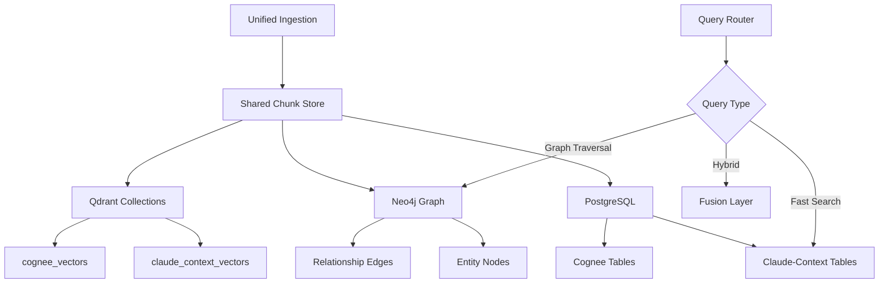

# Phase 1: Storage Architecture Analysis

## 🎯 Objective
Analyze and map the current storage architectures of both Claude-Context and Cognee to identify integration points and potential conflicts.

## 📊 Current State Analysis

### Claude-Context Storage Stack
```
PostgreSQL (5533) → pgvector extension → chunks table
     ↓                                       ↓
projects/datasets                      vectors (768d)
     ↓                                       ↓
Qdrant (6333) ←─────────────────────→ embeddings
```

### Cognee Storage Stack
```
SQLite/Postgres → metadata/state
        ↓
LanceDB/Qdrant → vectors
        ↓
Kuzu/Neo4j → knowledge graph
```

## 🔍 Discovery Tasks

### 1. Database Schema Analysis
```sql
-- Claude-Context Schema (PostgreSQL)
CREATE TABLE claude_context.chunks (
    id TEXT PRIMARY KEY,
    vector vector(768),
    content TEXT,
    relative_path TEXT,
    start_line INTEGER,
    end_line INTEGER,
    file_extension TEXT,
    project_id UUID,
    dataset_id UUID,
    source_type TEXT,
    metadata JSONB,
    created_at TIMESTAMPTZ DEFAULT NOW()
);

-- Cognee Schema (to be analyzed)
-- Need to examine Cognee's actual table structures
```

### 2. Storage Volume Analysis
```python
# Analyze storage requirements
async def analyze_storage_footprint():
    """
    Compare storage usage between systems:
    - Claude-Context: chunks + vectors + metadata
    - Cognee: documents + embeddings + graph
    """
    metrics = {
        "claude_context": {
            "postgres_size_mb": 0,
            "qdrant_size_mb": 0,
            "chunks_count": 0,
            "avg_chunk_size_kb": 0
        },
        "cognee": {
            "sqlite_size_mb": 0,
            "lancedb_size_mb": 0,
            "graph_nodes": 0,
            "graph_edges": 0
        }
    }
    return metrics
```

### 3. API Compatibility Matrix

| Feature | Claude-Context | Cognee | Compatible |
|---------|---------------|--------|------------|
| Chunk Storage | PostgreSQL | SQLite/Postgres | ✅ Yes |
| Vector Storage | Qdrant | Qdrant/LanceDB | ✅ Yes |
| Embedding Dims | 768 (GTE/CodeRank) | Variable | ⚠️ Needs mapping |
| Project Isolation | UUID-based | Dataset-based | ⚠️ Needs bridge |
| Graph Storage | None | Neo4j/Kuzu | ➕ New capability |

## 📐 Architecture Integration Points

### Primary Integration Strategy


## 🔧 Technical Requirements

### Storage Unification Requirements
1. **Shared PostgreSQL Instance**
   - Port: 5533 (existing)
   - Database: `claude_context` (extend with Cognee schemas)
   - Connection pooling for both systems

2. **Shared Qdrant Instance**
   - Port: 6333 (existing)
   - Namespace separation: `cc_*` vs `cognee_*`
   - Unified embedding space (768d)

3. **New Neo4j Instance**
   - Port: 7687 (standard)
   - Database: `knowledge_graph`
   - Linked to chunk IDs

## 📋 Implementation Checklist

- [ ] Export Claude-Context schema
- [ ] Export Cognee schema requirements
- [ ] Identify shared fields
- [ ] Map incompatible fields
- [ ] Design migration strategy
- [ ] Create compatibility layer design
- [ ] Document API differences
- [ ] Plan rollback strategy

## 🚨 Risk Assessment

### High-Risk Areas
1. **Schema Conflicts**: Different field types/names
2. **Transaction Boundaries**: Cross-system consistency
3. **Performance Impact**: Shared resource contention
4. **Data Migration**: Existing data compatibility

### Mitigation Strategies
1. Use database views for compatibility
2. Implement distributed transaction coordinator
3. Resource quotas and connection pooling
4. Incremental migration with validation

## 📊 Success Metrics

- Storage reduction: Target 30-40% by eliminating duplication
- Query latency: Maintain <100ms for vector search
- Graph queries: Target <500ms for 2-hop traversals
- Zero data loss during migration

## 🔄 Next Phase Prerequisites

Before proceeding to Phase 2:
1. Complete schema analysis for both systems
2. Document all table structures
3. Identify primary keys and foreign key relationships
4. Map data flow patterns
5. Get stakeholder approval on integration approach

## 📝 Notes

- Consider using PostgreSQL schemas for logical separation
- Evaluate pg_partman for time-based partitioning
- Research Qdrant's multi-tenancy features
- Document Neo4j's memory requirements

---

**Status**: 🔄 In Progress  
**Estimated Duration**: 3-4 days  
**Dependencies**: None  
**Output**: Complete storage architecture mapping document
