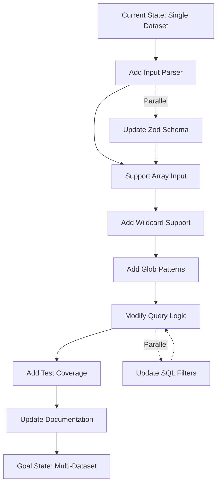

# Multi-Dataset Search: Plan Shard 1 - State Assessment & Goal Definition

## GOAP Framework: Current State → Goal State Analysis

### 🎯 Goal State Definition

```typescript
interface GoalState {
  capabilities: {
    singleDatasetSearch: true;      // ✅ Already exists
    multiDatasetSearch: true;        // 🎯 Target capability
    wildcardSearch: true;            // 🎯 Target capability
    globPatternSearch: true;         // 🎯 Target capability
    datasetArraySupport: true;       // 🎯 Target capability
  };
  
  apiSupport: {
    mcpToolsAcceptArray: true;       // 🎯 MCP tools accept dataset arrays
    apiServerAcceptArray: true;      // 🎯 API server handles arrays
    queryEngineSupport: true;        // 🎯 Query engine processes multiple
  };
  
  backendReadiness: {
    qdrantMultiCollection: true;     // ✅ Already supports
    postgresMultiDataset: true;      // ✅ Already supports
    datasetIdArrayHandling: true;    // ✅ Internal already uses arrays
  };
}
```

### 📊 Current State Analysis

```typescript
interface CurrentState {
  // Database Layer (PostgreSQL)
  database: {
    schema: {
      projects: "EXISTS",                    // ✅ claude_context.projects
      datasets: "EXISTS",                    // ✅ claude_context.datasets  
      dataset_collections: "EXISTS",         // ✅ claude_context.dataset_collections
      relationships: "ONE_TO_MANY"           // ✅ project → datasets → collections
    };
    
    capabilities: {
      multiDatasetQuery: true,               // ✅ Can query multiple datasets
      arrayParameterSupport: true,           // ✅ IN clause support
      accessibleDatasetsFunction: true       // ✅ getAccessibleDatasets()
    };
  };
  
  // Vector Storage (Qdrant)
  vectorStorage: {
    architecture: {
      collectionNaming: "{project}-{dataset}", // ✅ Unique per dataset
      multiCollectionQuery: true,              // ✅ Can query multiple
      hybridSearchSupport: true,               // ✅ Dense + sparse vectors
      rrfFusion: true                          // ✅ Reciprocal Rank Fusion
    };
    
    operations: {
      listCollections: "QdrantVectorDatabase.listCollections()",
      searchCollection: "QdrantVectorDatabase.search()",
      hybridQuery: "QdrantVectorDatabase.hybridQuery()",
      buildFilter: "buildFilter({ datasetIds: string[] })"  // ✅ Array ready!
    };
  };
  
  // Query Engine (src/api/query.ts)
  queryEngine: {
    internal: {
      datasetIdsArray: true,                  // ✅ let datasetIds: string[] = []
      multiCollectionSearch: true,            // ✅ Searches all collections
      aggregatedResults: true                 // ✅ Map<string, SearchResult>
    };
    
    limitations: {
      inputInterface: "SINGLE_STRING",        // ❌ dataset?: string
      noWildcardParsing: true,               // ❌ No "*" handling
      noGlobSupport: true,                   // ❌ No pattern matching
      noArrayInput: true                     // ❌ No string[] accepted
    };
  };
}
```

### 🔍 Gap Analysis

```typescript
interface StateGap {
  inputLayer: {
    current: "dataset?: string",
    target: "dataset?: string | string[]",
    actions: ["Update Zod schema", "Handle union type"]
  };
  
  parsingLayer: {
    current: "Direct string pass-through",
    target: "Parse wildcards, arrays, glob patterns",
    actions: ["Add pattern parser", "Handle special cases"]
  };
  
  queryLayer: {
    current: "Single dataset narrowing",
    target: "Multiple dataset filtering",
    actions: ["Modify SQL queries", "Handle array inputs"]
  };
  
  documentationLayer: {
    current: "Single dataset examples",
    target: "Multi-dataset usage patterns",
    actions: ["Update cc-tools.md", "Add examples"]
  };
}
```

## 🎮 GOAP State Space Definition

### World State Variables

```typescript
class WorldState {
  // Input State
  hasArrayInput: boolean = false;
  hasWildcardSupport: boolean = false;
  hasGlobPatterns: boolean = false;
  
  // Processing State
  canParseMultiDataset: boolean = false;
  canResolvePatterns: boolean = false;
  canBuildMultiFilter: boolean = false;
  
  // Query State
  supportsArrayQuery: boolean = false;
  aggregatesResults: boolean = true;     // Already true
  deduplicatesResults: boolean = true;   // Already true
  
  // Documentation State
  hasUpdatedDocs: boolean = false;
  hasTestCoverage: boolean = false;
  hasExamples: boolean = false;
}
```

### Goal Conditions

```typescript
const GOAL_CONDITIONS = {
  primary: {
    hasArrayInput: true,
    canParseMultiDataset: true,
    supportsArrayQuery: true,
    hasTestCoverage: true
  },
  
  secondary: {
    hasWildcardSupport: true,
    hasGlobPatterns: true,
    canResolvePatterns: true
  },
  
  tertiary: {
    hasUpdatedDocs: true,
    hasExamples: true
  }
};
```

## 🗺️ State Transition Map



## 🔬 State Assessment Functions

```typescript
// Heuristic function for A* planning
function heuristicDistance(current: WorldState, goal: WorldState): number {
  let distance = 0;
  
  // Primary goals (highest weight)
  if (!current.hasArrayInput) distance += 10;
  if (!current.canParseMultiDataset) distance += 10;
  if (!current.supportsArrayQuery) distance += 10;
  if (!current.hasTestCoverage) distance += 10;
  
  // Secondary goals (medium weight)
  if (!current.hasWildcardSupport) distance += 5;
  if (!current.hasGlobPatterns) distance += 5;
  if (!current.canResolvePatterns) distance += 5;
  
  // Tertiary goals (low weight)
  if (!current.hasUpdatedDocs) distance += 2;
  if (!current.hasExamples) distance += 2;
  
  return distance;
}

// State validation
function isGoalState(state: WorldState): boolean {
  return (
    state.hasArrayInput &&
    state.canParseMultiDataset &&
    state.supportsArrayQuery &&
    state.hasTestCoverage
  );
}
```

## 📈 Implementation Priority Matrix

| Component | Current State | Target State | Priority | Effort |
|-----------|--------------|--------------|----------|--------|
| Input Schema | `string?` | `string \| string[]` | 🔴 HIGH | Low |
| Dataset Parser | None | Pattern matcher | 🔴 HIGH | Medium |
| Query Builder | Single | Multiple | 🔴 HIGH | Medium |
| SQL Filters | Single ID | Array IDs | 🟡 MEDIUM | Low |
| Wildcard Handler | None | `"*"` → all | 🟡 MEDIUM | Low |
| Glob Matcher | None | `"github-*"` | 🟢 LOW | Medium |
| Test Suite | Basic | Comprehensive | 🔴 HIGH | High |
| Documentation | Outdated | Current | 🟡 MEDIUM | Low |

## 🚀 State Transition Costs

```typescript
const ACTION_COSTS = {
  // Low cost (quick wins)
  updateZodSchema: 1,
  modifySQLQuery: 2,
  addWildcardCheck: 2,
  updateDocumentation: 2,
  
  // Medium cost
  implementArrayParser: 5,
  addPatternMatcher: 5,
  updateAPIRoutes: 5,
  
  // High cost
  addGlobSupport: 8,
  implementFullTests: 10,
  refactorQueryEngine: 15
};
```

## 🎯 Success Metrics

```typescript
interface SuccessMetrics {
  functional: {
    canSearchMultipleDatasets: boolean;
    maintainsBackwardCompatibility: boolean;
    performanceImpact: "< 5%";
  };
  
  usability: {
    intuitiveAPI: boolean;
    clearDocumentation: boolean;
    goodErrorMessages: boolean;
  };
  
  technical: {
    testCoverage: "> 90%";
    codeComplexity: "< 10 cyclomatic";
    noBreakingChanges: boolean;
  };
}
```

## 📍 Key State Checkpoints

1. **Input Acceptance** ✅
   - Zod schema accepts union type
   - MCP tools handle arrays
   - API server parses correctly

2. **Pattern Resolution** 🔄
   - Wildcards expand to all datasets
   - Glob patterns match correctly
   - Arrays pass through cleanly

3. **Query Execution** 🎯
   - Multiple collections queried
   - Results aggregated properly
   - Performance acceptable

4. **User Experience** 🌟
   - Intuitive syntax
   - Clear error messages
   - Good documentation

---

**Next:** [Plan Shard 2 - Action Analysis →](plan-02-action-analysis.md)
