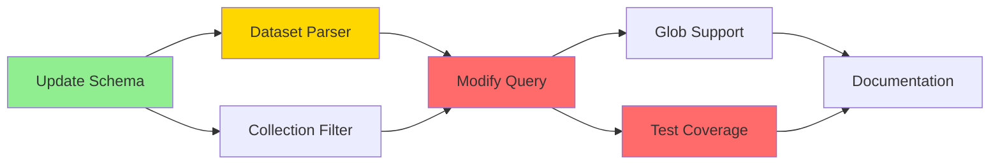

# Multi-Dataset Search: Plan Shard 2 - Action Analysis & Tool Implementation

## GOAP Action Inventory

### 🔧 Available Actions with Preconditions & Effects

```typescript
interface GOAPAction {
  name: string;
  cost: number;
  preconditions: Partial<WorldState>;
  effects: Partial<WorldState>;
  implementation: () => Promise<void>;
}
```

### Action 1: Update Input Schema

```typescript
const updateInputSchema: GOAPAction = {
  name: "UpdateZodSchema",
  cost: 1,
  preconditions: {
    // No preconditions - can be done immediately
  },
  effects: {
    hasArrayInput: true
  },
  implementation: async () => {
    // File: mcp-server.js, line 679
    const oldSchema = `dataset: z.string().optional()`;
    const newSchema = `dataset: z.union([
      z.string(),
      z.array(z.string())
    ]).optional().describe('Dataset(s): single, array, "*", or pattern')`;
    
    // File: src/api/query.ts - Update interface
    interface ProjectQueryRequest {
      project: string;
      dataset?: string | string[];  // Support both
      query: string;
      // ... other fields
    }
  }
};
```

### Action 2: Implement Dataset Parser

```typescript
const implementDatasetParser: GOAPAction = {
  name: "ImplementDatasetParser",
  cost: 5,
  preconditions: {
    hasArrayInput: true  // Must accept arrays first
  },
  effects: {
    canParseMultiDataset: true,
    hasWildcardSupport: true
  },
  implementation: async () => {
    // New file: src/utils/dataset-parser.ts
    class DatasetParser {
      /**
       * Parse dataset input into normalized array
       */
      static parse(
        input: string | string[] | undefined,
        availableDatasets: string[]
      ): string[] {
        // Handle undefined (search all)
        if (!input) return availableDatasets;
        
        // Normalize to array
        const datasets = Array.isArray(input) ? input : [input];
        
        // Handle wildcard
        if (datasets.length === 1 && datasets[0] === '*') {
          return availableDatasets;
        }
        
        // Handle patterns
        return datasets.flatMap(pattern => 
          this.matchPattern(pattern, availableDatasets)
        );
      }
      
      /**
       * Match glob pattern against available datasets
       */
      private static matchPattern(
        pattern: string,
        available: string[]
      ): string[] {
        // Simple glob: "github-*"
        if (pattern.includes('*')) {
          const regex = new RegExp(
            '^' + pattern.replace(/\*/g, '.*') + '$'
          );
          return available.filter(ds => regex.test(ds));
        }
        
        // Exact match
        return available.includes(pattern) ? [pattern] : [];
      }
    }
  }
};
```

### Action 3: Modify Query Logic

```typescript
const modifyQueryLogic: GOAPAction = {
  name: "ModifyQueryLogic",
  cost: 5,
  preconditions: {
    canParseMultiDataset: true
  },
  effects: {
    supportsArrayQuery: true,
    canResolvePatterns: true
  },
  implementation: async () => {
    // File: src/api/query.ts, lines 203-221
    // Current implementation (single dataset)
    const oldLogic = `
    if (request.dataset) {
      const datasetResult = await client.query(
        'SELECT id FROM claude_context.datasets WHERE project_id = $1 AND name = $2',
        [project.id, request.dataset]
      );
      // ... handle single
    }`;
    
    // New implementation (multiple datasets)
    const newLogic = `
    if (request.dataset) {
      // Parse input using DatasetParser
      const allDatasets = await client.query(
        'SELECT name FROM claude_context.datasets WHERE project_id = $1',
        [project.id]
      );
      const availableNames = allDatasets.rows.map(r => r.name);
      const requestedDatasets = DatasetParser.parse(
        request.dataset,
        availableNames
      );
      
      // Query multiple datasets
      if (requestedDatasets.length > 0) {
        const placeholders = requestedDatasets.map((_, i) => 
          \`$\${i + 2}\`
        ).join(', ');
        
        const datasetResult = await client.query(
          \`SELECT id FROM claude_context.datasets 
           WHERE project_id = $1 AND name IN (\${placeholders})\`,
          [project.id, ...requestedDatasets]
        );
        
        const selectedIds = datasetResult.rows.map(row => row.id);
        datasetIds = accessibleDatasetIds.filter(id => 
          selectedIds.includes(id)
        );
      }
    }`;
  }
};
```

### Action 4: Add Glob Pattern Support

```typescript
const addGlobSupport: GOAPAction = {
  name: "AddGlobPatternSupport",
  cost: 8,
  preconditions: {
    canParseMultiDataset: true
  },
  effects: {
    hasGlobPatterns: true,
    canResolvePatterns: true
  },
  implementation: async () => {
    // Enhance DatasetParser with advanced patterns
    class AdvancedPatternMatcher {
      static patterns = {
        // Version patterns
        'v*': /^v\d+/,                    // v1, v2, v3
        '*-dev': /.*-dev$/,                // anything-dev
        '*-prod': /.*-prod$/,              // anything-prod
        
        // Source patterns
        'github-*': /^github-/,            // github repos
        'crawl-*': /^crawl-/,              // crawled content
        'local*': /^local/,                // local variants
        
        // Complex patterns
        'github-*-main': /^github-.*-main$/,
        '*-v[0-9]*': /.*-v\d+/,
      };
      
      static match(pattern: string, datasets: string[]): string[] {
        // Check predefined patterns
        if (this.patterns[pattern]) {
          return datasets.filter(ds => 
            this.patterns[pattern].test(ds)
          );
        }
        
        // Convert glob to regex
        const regexPattern = pattern
          .replace(/\./g, '\\.')           // Escape dots
          .replace(/\*/g, '.*')             // * = any chars
          .replace(/\?/g, '.')              // ? = single char
          .replace(/\[([^\]]+)\]/g, '[$1]'); // Character classes
          
        const regex = new RegExp('^' + regexPattern + '$');
        return datasets.filter(ds => regex.test(ds));
      }
    }
  }
};
```

### Action 5: Update Collection Filter

```typescript
const updateCollectionFilter: GOAPAction = {
  name: "UpdateCollectionFilter",
  cost: 2,
  preconditions: {
    supportsArrayQuery: true
  },
  effects: {
    canBuildMultiFilter: true
  },
  implementation: async () => {
    // File: src/vectordb/qdrant-vectordb.ts, lines 733-738
    // Current filter builder
    const currentFilter = `
    if (filter.datasetIds && Array.isArray(filter.datasetIds)) {
      must.push({
        key: 'dataset_id',
        match: { any: filter.datasetIds }  // ✅ Already supports arrays!
      });
    }`;
    
    // Ensure query.ts passes array correctly
    // File: src/api/query.ts, line ~300
    const updateQueryFilter = `
    // Build filter for vector search
    const filter = {
      projectId: project?.id,
      datasetIds: datasetIds,  // Pass array directly
      repo: request.repo,
      lang: request.lang,
      pathPrefix: request.pathPrefix
    };`;
  }
};
```

### Action 6: Add Test Coverage

```typescript
const addTestCoverage: GOAPAction = {
  name: "AddTestCoverage",
  cost: 10,
  preconditions: {
    supportsArrayQuery: true,
    hasWildcardSupport: true
  },
  effects: {
    hasTestCoverage: true
  },
  implementation: async () => {
    // New file: src/api/__tests__/multi-dataset-query.spec.ts
    const tests = `
    describe('Multi-Dataset Query', () => {
      let context: Context;
      
      beforeEach(() => {
        // Setup test context with mock data
      });
      
      test('searches single dataset', async () => {
        const result = await queryProject(context, {
          project: 'test-project',
          dataset: 'local',
          query: 'test query'
        });
        expect(result.results).toBeDefined();
      });
      
      test('searches multiple datasets array', async () => {
        const result = await queryProject(context, {
          project: 'test-project',
          dataset: ['local', 'docs', 'github-main'],
          query: 'test query'
        });
        // Should search all 3 collections
        expect(mockVectorDb.search).toHaveBeenCalledTimes(3);
      });
      
      test('handles wildcard to search all', async () => {
        const result = await queryProject(context, {
          project: 'test-project',
          dataset: '*',
          query: 'test query'
        });
        // Should search all available datasets
        expect(result.results.length).toBeGreaterThan(0);
      });
      
      test('handles glob pattern matching', async () => {
        const result = await queryProject(context, {
          project: 'test-project',
          dataset: 'github-*',
          query: 'test query'
        });
        // Should only search github-prefixed datasets
        const searchedCollections = mockVectorDb.search.mock.calls
          .map(call => call[0]);
        expect(searchedCollections.every(c => 
          c.includes('github-')
        )).toBe(true);
      });
      
      test('maintains backward compatibility', async () => {
        const result = await queryProject(context, {
          project: 'test-project',
          dataset: 'single-dataset',  // String still works
          query: 'test query'
        });
        expect(result.results).toBeDefined();
      });
    });`;
  }
};
```

### Action 7: Update Documentation

```typescript
const updateDocumentation: GOAPAction = {
  name: "UpdateDocumentation",
  cost: 2,
  preconditions: {
    hasTestCoverage: true
  },
  effects: {
    hasUpdatedDocs: true,
    hasExamples: true
  },
  implementation: async () => {
    // Update cc-tools.md
    const docUpdate = `
    ### 7. \`claudeContext.search\` (ENHANCED)
    **Semantic Search with Multi-Dataset Support**
    
    Query indexed content across one or multiple datasets.
    
    **Parameters:**
    - \`query\` (required): Search query string
    - \`project\` (optional): Project name
    - \`dataset\` (optional): Dataset selection
      - Single string: \`"local"\`
      - Array: \`["local", "docs", "github-main"]\`
      - Wildcard: \`"*"\` (all datasets)
      - Pattern: \`"github-*"\` (glob matching)
    
    **Examples:**
    \`\`\`javascript
    // Search single dataset
    claudeContext.search({
      query: "authentication",
      dataset: "local"
    });
    
    // Search multiple specific datasets
    claudeContext.search({
      query: "API endpoints",
      dataset: ["docs", "api-ref", "github-main"]
    });
    
    // Search all datasets (explicit)
    claudeContext.search({
      query: "user management",
      dataset: "*"
    });
    
    // Search with pattern
    claudeContext.search({
      query: "deployment",
      dataset: "github-*"  // All GitHub sources
    });
    
    // Search all (implicit - omit dataset)
    claudeContext.search({
      query: "configuration"
      // No dataset = searches all
    });
    \`\`\``;
  }
};
```

## 🎯 Action Execution Strategy

### Parallel Action Groups

```typescript
const actionGroups = {
  // Group 1: Schema Updates (can run in parallel)
  foundation: [
    updateInputSchema,        // Cost: 1
    updateCollectionFilter,   // Cost: 2
  ],                         // Total: 3
  
  // Group 2: Core Logic (sequential)
  core: [
    implementDatasetParser,   // Cost: 5
    modifyQueryLogic,        // Cost: 5
  ],                         // Total: 10
  
  // Group 3: Enhancements (parallel)
  enhancements: [
    addGlobSupport,          // Cost: 8
    addTestCoverage,         // Cost: 10
  ],                         // Total: 18 (but parallel = 10)
  
  // Group 4: Documentation
  documentation: [
    updateDocumentation      // Cost: 2
  ]                          // Total: 2
};

// Total execution cost: 3 + 10 + 10 + 2 = 25 units
// Estimated time: 2-4 hours implementation
```

## 🔄 Action Dependencies Graph



## ⚡ Quick Win Actions (Low Cost, High Impact)

1. **Update Zod Schema** (Cost: 1)
   - Immediate benefit: API accepts arrays
   - No breaking changes
   - 5 minutes to implement

2. **Update Collection Filter** (Cost: 2)
   - Backend already supports arrays!
   - Just needs proper passing
   - 10 minutes to implement

3. **Add Wildcard Check** (Cost: 2)
   - Simple string comparison
   - Big usability win
   - 10 minutes to implement

---

**Next:** [Plan Shard 3 - Plan Generation →](plan-03-plan-generation.md)
