# Multi-Dataset Search: Plan Shard 3 - Plan Generation & Search Algorithm

## GOAP A* Search Implementation

### 🎯 Optimal Path Finding Algorithm

```typescript
class GOAPPlanner {
  private actions: GOAPAction[] = [];
  private currentState: WorldState;
  private goalState: Partial<WorldState>;
  
  /**
   * A* search to find optimal action sequence
   */
  findPlan(): ActionPlan {
    const openSet = new PriorityQueue<Node>();
    const closedSet = new Set<string>();
    
    const startNode: Node = {
      state: this.currentState,
      actions: [],
      cost: 0,
      heuristic: this.calculateHeuristic(this.currentState)
    };
    
    openSet.enqueue(startNode, startNode.cost + startNode.heuristic);
    
    while (!openSet.isEmpty()) {
      const current = openSet.dequeue();
      
      // Goal reached?
      if (this.isGoalState(current.state)) {
        return this.constructPlan(current.actions);
      }
      
      closedSet.add(this.stateHash(current.state));
      
      // Explore neighbors
      for (const action of this.getApplicableActions(current.state)) {
        const newState = this.applyAction(current.state, action);
        const stateKey = this.stateHash(newState);
        
        if (closedSet.has(stateKey)) continue;
        
        const newNode: Node = {
          state: newState,
          actions: [...current.actions, action],
          cost: current.cost + action.cost,
          heuristic: this.calculateHeuristic(newState)
        };
        
        openSet.enqueue(newNode, newNode.cost + newNode.heuristic);
      }
    }
    
    throw new Error('No plan found to reach goal state');
  }
}
```

## 🚀 Optimal Implementation Plan

### Phase 1: Foundation (Parallel Execution)
**Duration: 30 minutes | Cost: 3 units**

```typescript
const phase1Plan = {
  parallel: true,
  actions: [
    {
      name: "UpdateZodSchema",
      file: "mcp-server.js",
      lines: [679],
      change: `
        // Before
        dataset: z.string().optional()
        
        // After  
        dataset: z.union([
          z.string(),
          z.array(z.string()),
          z.literal('*')
        ]).optional()
      `,
      validation: "MCP server starts without errors"
    },
    {
      name: "UpdateQueryInterface",
      file: "src/api/query.ts",
      lines: [30],
      change: `
        export interface ProjectQueryRequest {
          project: string;
          dataset?: string | string[];  // Now accepts array
          query: string;
          // ... rest unchanged
        }
      `,
      validation: "TypeScript compiles without errors"
    }
  ]
};
```

### Phase 2: Core Parser Implementation
**Duration: 1 hour | Cost: 5 units**

```typescript
// New file: src/utils/dataset-parser.ts
export class DatasetParser {
  /**
   * Parse and resolve dataset patterns
   * @param input User input (string, array, or wildcard)
   * @param available Available dataset names
   * @returns Resolved dataset names
   */
  static parse(
    input: string | string[] | undefined,
    available: string[]
  ): string[] {
    // No input = all datasets
    if (!input) return available;
    
    // Normalize to array
    const patterns = Array.isArray(input) ? input : [input];
    
    // Process each pattern
    const resolved = new Set<string>();
    
    for (const pattern of patterns) {
      // Wildcard: "*" 
      if (pattern === '*') {
        return available; // Return all immediately
      }
      
      // Glob pattern: contains * or ?
      if (pattern.includes('*') || pattern.includes('?')) {
        const matches = this.matchGlob(pattern, available);
        matches.forEach(m => resolved.add(m));
      } 
      // Range pattern: [1-3] or [a-z]
      else if (pattern.includes('[') && pattern.includes(']')) {
        const matches = this.matchRange(pattern, available);
        matches.forEach(m => resolved.add(m));
      }
      // Exact match
      else if (available.includes(pattern)) {
        resolved.add(pattern);
      }
    }
    
    return Array.from(resolved);
  }
  
  /**
   * Convert glob pattern to regex and match
   */
  private static matchGlob(pattern: string, datasets: string[]): string[] {
    // Escape special regex chars except glob wildcards
    const regexStr = pattern
      .replace(/[.+^${}()|[\]\\]/g, '\\$&')  // Escape regex chars
      .replace(/\*/g, '.*')                   // * = any chars
      .replace(/\?/g, '.');                   // ? = single char
      
    const regex = new RegExp(`^${regexStr}$`);
    return datasets.filter(ds => regex.test(ds));
  }
  
  /**
   * Match character ranges like v[1-3] or test-[a-c]
   */
  private static matchRange(pattern: string, datasets: string[]): string[] {
    // Convert [1-3] to (1|2|3), [a-c] to (a|b|c)
    const expanded = pattern.replace(
      /\[([a-z])-([a-z])\]/gi,
      (match, start, end) => {
        const chars = [];
        for (let i = start.charCodeAt(0); i <= end.charCodeAt(0); i++) {
          chars.push(String.fromCharCode(i));
        }
        return `(${chars.join('|')})`;
      }
    ).replace(
      /\[(\d)-(\d)\]/g,
      (match, start, end) => {
        const nums = [];
        for (let i = parseInt(start); i <= parseInt(end); i++) {
          nums.push(i.toString());
        }
        return `(${nums.join('|')})`;
      }
    );
    
    const regex = new RegExp(`^${expanded}$`);
    return datasets.filter(ds => regex.test(ds));
  }
}
```

### Phase 3: Query Logic Integration
**Duration: 1 hour | Cost: 5 units**

```typescript
// File: src/api/query.ts
// Lines: 203-221 (replacement)

async function resolveDatasets(
  client: PoolClient | Pool,
  project: { id: string; name: string },
  request: ProjectQueryRequest,
  accessibleDatasetIds: string[]
): Promise<string[]> {
  // Get all available dataset names for pattern matching
  const allDatasetsResult = await client.query(
    `SELECT id, name FROM claude_context.datasets 
     WHERE project_id = $1`,
    [project.id]
  );
  
  const datasetMap = new Map(
    allDatasetsResult.rows.map(row => [row.name, row.id])
  );
  const availableNames = Array.from(datasetMap.keys());
  
  // Parse dataset input
  const requestedNames = DatasetParser.parse(
    request.dataset,
    availableNames
  );
  
  // Convert names to IDs
  const requestedIds = requestedNames
    .map(name => datasetMap.get(name))
    .filter((id): id is string => id !== undefined);
  
  // Filter to only accessible datasets
  return accessibleDatasetIds.filter(id => 
    requestedIds.includes(id)
  );
}

// Integration point in queryProject()
export async function queryProject(
  context: Context,
  request: ProjectQueryRequest,
  onProgress?: (phase: string, percentage: number, detail: string) => void
): Promise<ProjectQueryResponse> {
  // ... existing setup code ...
  
  // Replace lines 203-221 with:
  if (request.dataset) {
    datasetIds = await resolveDatasets(
      client,
      project,
      request,
      accessibleDatasetIds
    );
    
    if (datasetIds.length === 0) {
      return { 
        requestId, 
        results: [], 
        metadata: makeEmptyMetadata() 
      };
    }
    
    onProgress?.(
      'query', 
      25, 
      `Searching ${datasetIds.length} dataset(s)`
    );
  }
  
  // ... rest of function unchanged ...
}
```

### Phase 4: Advanced Pattern Support
**Duration: 1 hour | Cost: 8 units**

```typescript
// Enhanced pattern matching capabilities
class PatternLibrary {
  static readonly COMMON_PATTERNS = {
    // Environment patterns
    environments: {
      'env:dev': ['dev', 'development', 'staging'],
      'env:prod': ['prod', 'production', 'live'],
      'env:test': ['test', 'testing', 'qa']
    },
    
    // Source patterns
    sources: {
      'src:code': ['local', 'github-*', 'gitlab-*'],
      'src:docs': ['docs', 'wiki', 'readme'],
      'src:external': ['crawl-*', 'api-*']
    },
    
    // Version patterns
    versions: {
      'ver:latest': (datasets: string[]) => {
        // Find highest version number
        const versioned = datasets.filter(ds => /v\d+/.test(ds));
        if (versioned.length === 0) return [];
        return [versioned.sort().pop()!];
      },
      'ver:stable': (datasets: string[]) => {
        return datasets.filter(ds => 
          !ds.includes('dev') && 
          !ds.includes('beta') &&
          !ds.includes('alpha')
        );
      }
    }
  };
  
  static expand(pattern: string, available: string[]): string[] {
    // Check aliases
    for (const [category, patterns] of Object.entries(this.COMMON_PATTERNS)) {
      if (pattern in patterns) {
        const expansion = patterns[pattern as keyof typeof patterns];
        if (typeof expansion === 'function') {
          return expansion(available);
        }
        // Recursively expand each pattern
        return expansion.flatMap(p => 
          DatasetParser.parse(p, available)
        );
      }
    }
    
    return [];
  }
}
```

## 📊 Execution Timeline

```mermaid
gantt
    title Multi-Dataset Search Implementation
    dateFormat HH:mm
    axisFormat %H:%M
    
    section Phase 1
    Update Schema     :done, p1a, 00:00, 15m
    Update Interface  :done, p1b, 00:00, 15m
    
    section Phase 2  
    Create Parser     :active, p2a, 00:30, 30m
    Add Tests        :active, p2b, 00:45, 30m
    
    section Phase 3
    Integrate Query   :p3a, 01:30, 45m
    Test Integration  :p3b, 02:00, 15m
    
    section Phase 4
    Pattern Support   :p4a, 02:15, 45m
    Documentation     :p4b, 02:45, 15m
```



## 🧪 Validation Plan

```typescript
const validationSteps = [
  {
    phase: 1,
    test: "Schema accepts arrays",
    command: "npm run test -- --testNamePattern='accepts array input'",
    expected: "✓ Zod validates string | string[]"
  },
  {
    phase: 2,
    test: "Parser handles patterns",
    command: "npm run test -- dataset-parser.spec.ts",
    expected: "✓ All pattern types resolve correctly"
  },
  {
    phase: 3,
    test: "Query executes multi-dataset",
    command: "npm run test -- multi-dataset-query.spec.ts",
    expected: "✓ Multiple collections searched"
  },
  {
    phase: 4,
    test: "End-to-end MCP test",
    command: "claudeContext.search({dataset: ['local', 'docs']})",
    expected: "Returns combined results"
  }
];
```

## 🎮 Rollback Strategy

```typescript
interface RollbackPlan {
  triggers: {
    performanceDegradation: "> 10% latency increase";
    errorRate: "> 1% query failures";
    backwardCompatibility: "Any breaking change detected";
  };
  
  actions: {
    immediate: "Revert schema changes",
    phase1: "Restore single-string interface",
    phase2: "Disable parser, fallback to direct",
    phase3: "Use feature flag for multi-dataset"
  };
  
  featureFlag: {
    name: "ENABLE_MULTI_DATASET_SEARCH",
    default: false,
    rollout: "10% → 50% → 100% over 3 days"
  };
}
```

## ✅ Success Criteria

1. **Functional**
   - Single dataset queries work (backward compatible)
   - Array queries return combined results
   - Wildcard `*` searches all datasets
   - Glob patterns match correctly

2. **Performance**
   - < 5% latency increase for single dataset
   - < 20% latency for multi-dataset (acceptable)
   - No memory leaks
   - Efficient deduplication

3. **Usability**
   - Intuitive syntax
   - Clear error messages
   - Good documentation
   - TypeScript autocomplete works

---

**Next:** [Plan Shard 4 - Execution & Monitoring →](plan-04-execution-monitoring.md)
