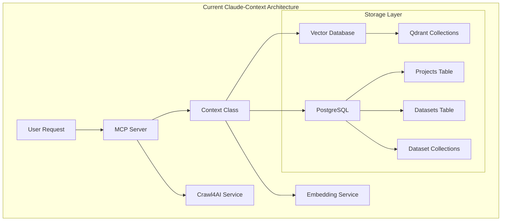
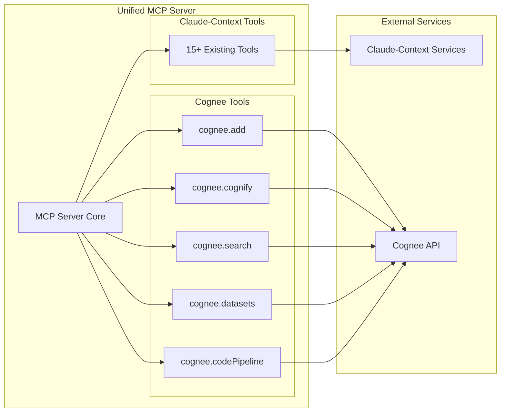
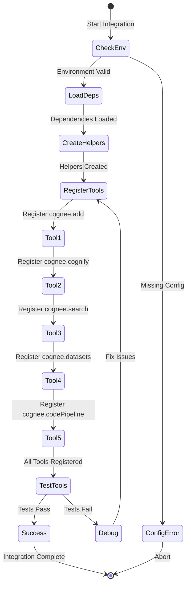

# Part 1: Cognee MCP Integration - State Assessment & Current System Analysis
## GOAP Planning Phase 1: Understanding the Current State

### Executive Summary
This document analyzes the current state of the Claude-Context Core system and assesses
the requirements for integrating Cognee API as MCP (Model Context Protocol) tools. Using
Goal-Oriented Action Planning (GOAP) methodology, we evaluate preconditions, effects, and
the path from current state to desired goal state.

---

## 1. Current State Analysis

### 1.1 System Architecture Overview

#### Existing MCP Server Infrastructure
```javascript
// Current MCP Server Structure (mcp-server.js)
const mcpServer = new McpServer({
  name: 'claude-context-core-dev',
  version: pkg.version
}, {
  instructions: '...'
});

// Tool namespace pattern
const toolNamespace = 'claudeContext';

// Tool registration pattern
mcpServer.registerTool(`${toolNamespace}.toolName`, {
  title: 'Tool Title',
  description: 'Tool Description',
  inputSchema: { /* zod schema */ }
}, async (params) => {
  // Tool implementation
});
```

#### Current Dependencies
- **zod**: Schema validation library
- **node-fetch**: HTTP client (dynamic import pattern)
- **form-data**: Multipart form handling
- **McpServer**: MCP server implementation
- **StdioServerTransport**: Communication transport

#### Environment Variables in Use
```bash
# Claude-Context Core variables
EMBEDDING_API_BASE=http://localhost:30001
EMBEDDING_MODEL=GTE
VECTOR_DATABASE=qdrant
QDRANT_URL=http://localhost:6333
POSTGRES_URL=postgresql://...
LLM_API_BASE=https://api.groq.com/openai/v1
LLM_API_KEY=gsk_...
MODEL_NAME=openai/gpt-oss-120b
CRAWL4AI_URL=http://localhost:7070

# New variables needed for Cognee
COGNEE_URL=http://localhost:8340  # Or https://api.cognee.ai
COGNEE_TOKEN=<bearer-token>        # Optional for authentication
```

### 1.2 Current Tool Categories

#### 1.2.1 Configuration Tools
```javascript
- claudeContext.init      // Set default project/dataset
- claudeContext.defaults  // Show current defaults
- claudeContext.autoScope // Preview auto-scoping
```

#### 1.2.2 Indexing Tools
```javascript
- claudeContext.index       // Index codebase with project awareness
- claudeContext.reindex     // Re-index changed files (legacy)
- claudeContext.ingestCrawl // Ingest Crawl4AI pages
```

#### 1.2.3 Search Tools
```javascript
- claudeContext.search         // Semantic search (project-aware)
- claudeContext.searchChunks   // Search with scope filtering
- claudeContext.getChunk      // Retrieve specific chunk
```

#### 1.2.4 Management Tools
```javascript
- claudeContext.status    // Check index status
- claudeContext.clear     // Delete collections
- claudeContext.listScopes // List available scopes
```

#### 1.2.5 Crawling Tools
```javascript
- claudeContext.crawl        // Trigger web crawling
- claudeContext.crawlStatus  // Check crawl progress
- claudeContext.cancelCrawl  // Cancel running crawl
```

### 1.3 Data Flow Architecture



### 1.4 Authentication & Security Model

#### Current Authentication
- No authentication required for local MCP tools
- PostgreSQL uses connection string authentication
- Qdrant uses optional API key
- Crawl4AI runs locally without authentication

#### Cognee Authentication Requirements
- Bearer token authentication for Cognee API
- Optional for local Cognee instances
- Required for cloud Cognee (api.cognee.ai)
- Token passed in Authorization header

---

## 2. Goal State Definition

### 2.1 Desired System Capabilities

#### Primary Goals
1. **Seamless Integration**: Cognee tools alongside existing Claude-Context tools
2. **Unified Interface**: Single MCP server handling both systems
3. **Knowledge Graph Creation**: Transform documents into structured graphs
4. **Multi-Type Search**: Support 12+ search types through Cognee
5. **Dataset Management**: Create, list, delete datasets via API
6. **Code Intelligence**: Index and retrieve code repository knowledge

#### Success Criteria
- [ ] All 5 Cognee tool groups functional
- [ ] Error handling for network/auth failures
- [ ] Structured content responses for Claude
- [ ] Async operation support (background processing)
- [ ] File upload capability via multipart/form-data
- [ ] URL and GitHub repository ingestion

### 2.2 Tool Integration Requirements

#### Tool 1: cognee.add
```javascript
Purpose: Add files/URLs to datasets
Input: 
  - datasetName or datasetId (required)
  - files: Array of file paths
  - urls: Array of HTTP/GitHub URLs
Method: POST multipart/form-data
Output: Success message with item count
```

#### Tool 2: cognee.cognify
```javascript
Purpose: Transform datasets into knowledge graphs
Input:
  - datasets: Array of dataset names
  - datasetIds: Array of UUIDs
  - runInBackground: Boolean
Method: POST JSON
Output: Processing status/pipeline run ID
```

#### Tool 3: cognee.search
```javascript
Purpose: Query knowledge graphs
Input:
  - searchType: Enum (12 types)
  - query: String
  - datasets/datasetIds: Arrays
  - topK: Number (1-100)
Method: POST JSON
Output: Search results array
```

#### Tool 4: cognee.datasets
```javascript
Purpose: Manage datasets (CRUD operations)
Actions:
  - list: GET all datasets
  - create: POST new dataset
  - delete: DELETE dataset
  - deleteData: DELETE specific data item
Method: Various HTTP methods
Output: Dataset info/confirmation
```

#### Tool 5: cognee.codePipeline
```javascript
Purpose: Code repository analysis
Actions:
  - index: Process repository
  - retrieve: Get code context
Method: POST JSON
Output: Processing status/results
```

### 2.3 Integration Architecture



---

## 3. Gap Analysis

### 3.1 Technical Gaps

#### Missing Dependencies
```javascript
// Required for Cognee integration
- node-fetch (already available via dynamic import)
- form-data (needs to be imported/required)
- FormData polyfill for Node.js environments
```

#### Network Layer Requirements
```javascript
// Helper functions needed
function getCogneeBase() {
  return (process.env.COGNEE_URL || 'https://api.cognee.ai').replace(/\/+$/,'');
}

function authHeaders(headers = {}) {
  const token = process.env.COGNEE_TOKEN;
  return token ? { ...headers, Authorization: `Bearer ${token}` } : headers;
}

async function fetchJson(method, pathname, body) {
  // JSON API calls with error handling
}

async function fetchForm(pathname, form) {
  // Multipart form submissions
}
```

### 3.2 Functional Gaps

| Component | Current State | Required State | Gap |
|-----------|--------------|----------------|-----|
| Multipart Upload | Not implemented | File streaming support | Need FormData handling |
| Bearer Auth | Not used | Authorization header | Add auth helper |
| Async Processing | Limited | Background jobs | WebSocket monitoring |
| Search Types | Single semantic | 12 search types | Enum validation |
| Dataset Management | Project-based | Dataset CRUD | New API layer |
| Code Analysis | Local indexing | Repository graphs | Code pipeline |

### 3.3 Error Handling Gaps

#### Current Error Handling
```javascript
// Simple try-catch with message return
try {
  // operation
} catch (error) {
  return {
    content: [{
      type: 'text',
      text: `Operation failed: ${error.message}`
    }],
    isError: true
  };
}
```

#### Required Error Handling
```javascript
// Enhanced error handling with status codes
try {
  const response = await fetch(url, options);
  const text = await response.text();
  
  if (!response.ok) {
    // Parse error details from response
    let errorDetails;
    try {
      errorDetails = JSON.parse(text);
    } catch {
      errorDetails = text;
    }
    
    throw new Error(
      `${method} ${pathname} -> ${response.status} ${response.statusText}: ${text}`
    );
  }
  
  return JSON.parse(text);
} catch (error) {
  // Structured error response
  return {
    content: [{
      type: 'text',
      text: String(error)
    }],
    isError: true,
    structuredContent: {
      statusCode: error.statusCode,
      errorType: error.name,
      details: error.details
    }
  };
}
```

---

## 4. State Transition Requirements

### 4.1 Preconditions for Integration

#### Environment Setup
- [ ] COGNEE_URL environment variable configured
- [ ] COGNEE_TOKEN available (for cloud API)
- [ ] Network connectivity to Cognee service
- [ ] MCP server running with proper permissions

#### Code Prerequisites
- [ ] MCP server initialized
- [ ] Zod schema validation available
- [ ] Transport connection established
- [ ] Error handling middleware ready

### 4.2 Action Sequence



### 4.3 Effects of Each Action

#### Action: Load Dependencies
**Preconditions:**
- Node.js environment
- Package.json configured

**Effects:**
- node-fetch available
- form-data loaded
- Zod schemas ready

#### Action: Create Helper Functions
**Preconditions:**
- Dependencies loaded
- Environment variables set

**Effects:**
- getCogneeBase() available
- authHeaders() ready
- fetchJson() functional
- fetchForm() operational

#### Action: Register Tools
**Preconditions:**
- MCP server initialized
- Helper functions created
- Schemas defined

**Effects:**
- Tools available to Claude
- API endpoints mapped
- Error handling active

---

## 5. Risk Assessment

### 5.1 Technical Risks

| Risk | Probability | Impact | Mitigation |
|------|------------|---------|------------|
| Network failures | Medium | High | Retry logic, timeout handling |
| Auth token expiry | Low | Medium | Token refresh mechanism |
| Large file uploads | Medium | Medium | Streaming, chunking |
| API rate limits | Low | High | Request throttling |
| Schema mismatches | Low | High | Version checking |

### 5.2 Operational Risks

#### Data Consistency
- **Risk**: Mismatch between Claude-Context and Cognee data
- **Mitigation**: Clear namespace separation (claudeContext vs cognee)

#### Performance Impact
- **Risk**: Slow API responses affecting MCP server
- **Mitigation**: Async operations, background processing

#### Error Propagation
- **Risk**: Cognee failures affecting Claude-Context tools
- **Mitigation**: Isolated error handling per tool

### 5.3 Security Considerations

```javascript
// Secure token handling
const token = process.env.COGNEE_TOKEN;
if (!token && isProductionEnvironment()) {
  console.warn('COGNEE_TOKEN not set - using unauthenticated mode');
}

// Input validation
const sanitizeDatasetName = (name) => {
  return name.replace(/[^a-zA-Z0-9-_]/g, '_');
};

// File path validation
const validateFilePath = (path) => {
  if (!fs.existsSync(path)) {
    throw new Error(`File not found: ${path}`);
  }
  const stats = fs.statSync(path);
  if (stats.size > MAX_FILE_SIZE) {
    throw new Error(`File too large: ${stats.size} bytes`);
  }
  return true;
};
```

---

## 6. Implementation Priorities

### 6.1 Phase 1: Foundation (High Priority)
1. Environment configuration
2. Helper function implementation
3. Error handling framework
4. Basic connectivity test

### 6.2 Phase 2: Core Tools (High Priority)
1. cognee.datasets (list/create) - Dataset management
2. cognee.add - Data ingestion
3. cognee.cognify - Graph generation

### 6.3 Phase 3: Search & Retrieval (Medium Priority)
1. cognee.search - All search types
2. Search result formatting
3. Pagination support

### 6.4 Phase 4: Advanced Features (Low Priority)
1. cognee.codePipeline - Code analysis
2. WebSocket monitoring
3. Background job tracking

---

## 7. State Validation Criteria

### 7.1 Unit Testing Requirements

```javascript
// Test environment setup
describe('Cognee Integration', () => {
  beforeAll(() => {
    process.env.COGNEE_URL = 'http://localhost:8340';
    process.env.COGNEE_TOKEN = 'test-token';
  });
  
  test('Helper functions exist', () => {
    expect(getCogneeBase).toBeDefined();
    expect(authHeaders).toBeDefined();
    expect(fetchJson).toBeDefined();
    expect(fetchForm).toBeDefined();
  });
  
  test('Tools are registered', () => {
    expect(mcpServer.hasTools('cognee.add')).toBe(true);
    expect(mcpServer.hasTools('cognee.cognify')).toBe(true);
    expect(mcpServer.hasTools('cognee.search')).toBe(true);
    expect(mcpServer.hasTools('cognee.datasets')).toBe(true);
    expect(mcpServer.hasTools('cognee.codePipeline')).toBe(true);
  });
});
```

### 7.2 Integration Testing

```javascript
// End-to-end workflow test
describe('Cognee Workflow', () => {
  test('Complete dataset lifecycle', async () => {
    // 1. Create dataset
    const createResult = await mcpServer.executeTool('cognee.datasets', {
      action: 'create',
      name: 'test-dataset'
    });
    expect(createResult.isError).toBe(false);
    
    // 2. Add data
    const addResult = await mcpServer.executeTool('cognee.add', {
      datasetName: 'test-dataset',
      urls: ['https://example.com/doc.txt']
    });
    expect(addResult.isError).toBe(false);
    
    // 3. Cognify
    const cognifyResult = await mcpServer.executeTool('cognee.cognify', {
      datasets: ['test-dataset'],
      runInBackground: false
    });
    expect(cognifyResult.isError).toBe(false);
    
    // 4. Search
    const searchResult = await mcpServer.executeTool('cognee.search', {
      searchType: 'CHUNKS',
      query: 'test query',
      datasets: ['test-dataset']
    });
    expect(searchResult.isError).toBe(false);
    
    // 5. Cleanup
    const deleteResult = await mcpServer.executeTool('cognee.datasets', {
      action: 'delete',
      datasetId: createResult.structuredContent.id
    });
    expect(deleteResult.isError).toBe(false);
  });
});
```

### 7.3 Performance Benchmarks

| Operation | Target Time | Acceptable Range |
|-----------|------------|------------------|
| Dataset Create | < 500ms | 200-1000ms |
| File Add (1MB) | < 2s | 1-5s |
| Cognify (10 docs) | < 30s | 10-60s |
| Search Query | < 1s | 500-2000ms |
| Dataset List | < 300ms | 100-500ms |

---

## 8. Monitoring & Observability

### 8.1 Logging Strategy

```javascript
// Structured logging for Cognee operations
const logCogneeOperation = (operation, params, result, duration) => {
  mcpServer.sendLoggingMessage({
    level: result.isError ? 'error' : 'info',
    logger: 'cognee-integration',
    data: {
      operation,
      params: sanitizeParams(params),
      success: !result.isError,
      duration,
      timestamp: new Date().toISOString()
    }
  });
};

// Performance tracking
const trackPerformance = (operation) => {
  return async (params) => {
    const start = Date.now();
    try {
      const result = await operation(params);
      const duration = Date.now() - start;
      logCogneeOperation(operation.name, params, result, duration);
      return result;
    } catch (error) {
      const duration = Date.now() - start;
      logCogneeOperation(operation.name, params, { isError: true }, duration);
      throw error;
    }
  };
};
```

### 8.2 Health Checks

```javascript
// Cognee service health check
const checkCogneeHealth = async () => {
  try {
    const response = await fetch(`${getCogneeBase()}/health`, {
      headers: authHeaders()
    });
    return {
      healthy: response.ok,
      statusCode: response.status,
      latency: response.headers.get('x-response-time')
    };
  } catch (error) {
    return {
      healthy: false,
      error: error.message
    };
  }
};

// Periodic health monitoring
setInterval(async () => {
  const health = await checkCogneeHealth();
  if (!health.healthy) {
    console.error('Cognee service unhealthy:', health);
  }
}, 60000); // Check every minute
```

---

## 9. State Machine Summary

### 9.1 Current State Vector
```javascript
currentState = {
  // System capabilities
  hasClaudeContext: true,
  hasCogneeIntegration: false,
  
  // Environment
  cogneeUrl: null,
  cogneeToken: null,
  
  // Tools available
  tools: {
    claudeContext: 15,
    cognee: 0
  },
  
  // Operational status
  status: 'pre-integration',
  errors: [],
  warnings: []
};
```

### 9.2 Goal State Vector
```javascript
goalState = {
  // System capabilities
  hasClaudeContext: true,
  hasCogneeIntegration: true,
  
  // Environment
  cogneeUrl: process.env.COGNEE_URL || 'https://api.cognee.ai',
  cogneeToken: process.env.COGNEE_TOKEN || null,
  
  // Tools available
  tools: {
    claudeContext: 15,
    cognee: 5
  },
  
  // Operational status
  status: 'operational',
  errors: [],
  warnings: []
};
```

### 9.3 Transition Actions
```javascript
const actions = [
  {
    name: 'configureEnvironment',
    preconditions: ['hasEnvironmentAccess'],
    effects: ['cogneeUrlSet', 'cogneeTokenSet']
  },
  {
    name: 'loadDependencies',
    preconditions: ['nodeEnvironment'],
    effects: ['dependenciesLoaded']
  },
  {
    name: 'createHelpers',
    preconditions: ['dependenciesLoaded', 'cogneeUrlSet'],
    effects: ['helpersAvailable']
  },
  {
    name: 'registerTools',
    preconditions: ['helpersAvailable', 'mcpServerReady'],
    effects: ['toolsRegistered']
  },
  {
    name: 'validateIntegration',
    preconditions: ['toolsRegistered'],
    effects: ['integrationValidated']
  }
];
```

---

## 10. Conclusion & Next Steps

### 10.1 Summary
This state assessment has identified:
- **Current capabilities**: 15 Claude-Context tools operational
- **Integration requirements**: 5 Cognee tool groups needed
- **Technical gaps**: Multipart handling, auth headers, error handling
- **Implementation path**: 4-phase rollout strategy

### 10.2 Immediate Actions
1. Configure COGNEE_URL and COGNEE_TOKEN environment variables
2. Implement helper functions for API communication
3. Create structured error handling framework
4. Begin tool registration with cognee.datasets

### 10.3 Success Metrics
- [ ] All 5 Cognee tools successfully registered
- [ ] End-to-end workflow test passing
- [ ] Performance within acceptable ranges
- [ ] Error handling comprehensive
- [ ] Documentation complete

### 10.4 References
- [Cognee API Documentation](https://docs.cognee.ai/api-reference)
- [MCP Server Documentation](internal)
- [Claude-Context Core](internal)
- [GOAP Planning Methodology](internal)

---

*End of Part 1: State Assessment & Current System Analysis*
