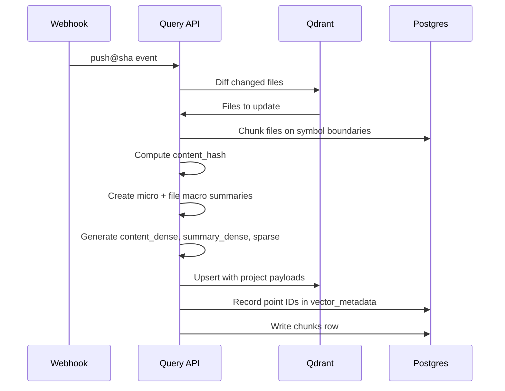

# Pipelines

## GitHub Ingest (Diff-First)

**Steps:**
1. **Webhook** `push@sha` → enqueue `repo.index@sha`
2. **Diff** changed files
3. **Chunk** (tree-sitter/ctags) on **symbol boundaries**; compute `content_hash`
4. **Summarize**: micro (≤256 tok) + file macro (store macro in object store, link in payload/DB)
5. **Embed**: `content_dense`, `summary_dense`, plus **sparse terms**
6. **Upsert** to Qdrant with **project payloads**; record point IDs in **`vector_metadata`**
7. **Write** `chunks` row with `vector_id`, `summary_vector_id`

## Crawl4AI Ingest (Project-Aware)

**Steps:**
1. Use **`web_pages`** for content + metadata
2. Use **`crawl_sessions`** to track jobs and metrics
3. Upsert pages via **`upsert_web_page_v3(project, dataset, ...)`** helper
   - Auto-creates project/dataset if needed
   - Attaches to correct project
4. Chunk → summarize → embed → upsert to Qdrant
5. Write vector IDs to **`vector_metadata`** and chunks to **`chunks`**

## Event Bus (Bi-directional Async)

Each stage emits events:
- `file.changed`
- `chunk.created`
- `chunk.summarized`
- `vector.upserted`
- `crawl.completed`
- `query.issued`
- `rerank.logged`

**Idempotency keys:** `source:sha:relpath:chunk_index:content_hash`

Use session IDs for traceability (already in schema).
