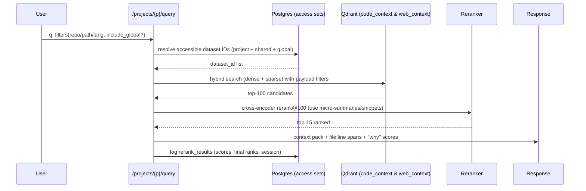

# Retrieval Algorithm

## Sequence Diagram

## Algorithm Steps

1. **Access Resolution**
   - Expand to: *this project* ∪ *explicit shares* ∪ *global content*
   - Uses `is_global` flags + `project_shares`
   - SQL: `accessible_dataset_ids = {project_id} ∪ {datasets with is_global} ∪ {datasets shared via project_shares}`

2. **Hybrid Search (Dense + Sparse)**
   - Query Qdrant with payload filters
   - `must`: `dataset_id ∈ accessible_dataset_ids`
   - Optional: `repo/path/lang` filters
   - Retrieve top-100 candidates

3. **Cross-Encoder Rerank**
   - Rerank top-100 using micro-summaries/snippets
   - Output top-15 ranked results

4. **Context Packing**
   - Macro-aware: merge adjacent spans
   - Include macro once when multiple chunks from same file
   - Return "why" evidence (scores + file:line spans + project/dataset IDs)

5. **Logging**
   - Persist scores & ranks to **`rerank_results`**
   - Track `search_session_id` for grouped analysis
   - Enables MRR/nDCG computation

## Filters & Access

**Project Visibility Enforcement:**
1. SQL first: resolve accessible `dataset_id` set
2. Pass **only those IDs** into Qdrant filters
3. Re-check access using **`is_resource_accessible(project, type, id)`** before returning context

**Global Content:**
- Keep in `global` project
- Queryable everywhere via `is_global` flag
- Share tactical datasets via **`project_shares`**
