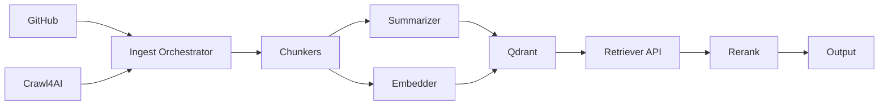

# Hybrid Retrieval System - Implementation Plan

## Overview

This plan documents the upgrade to a **project-scoped context engine** that ingests code (GitHub) and web content (Crawl4AI), creates **content + summary + sparse** representations, stores them in **Qdrant** (named vectors + sparse), **filters by project** at query time, runs **hybrid top-K → cross-encoder rerank**, and returns citations with exact spans.

## Plan Structure

- **[Architecture](./01-architecture.md)** - System design and dataflow
- **[Data Model](./02-data-model.md)** - Database schemas and collections
- **[Pipelines](./03-pipelines.md)** - Ingestion workflows for GitHub and web
- **[Retrieval Algorithm](./04-retrieval.md)** - Search and ranking logic
- **[API Specification](./05-api.md)** - Endpoints and interfaces
- **[Milestones](./06-milestones.md)** - Phased implementation plan
- **[Implementation Notes](./07-implementation.md)** - Technical details and code sketches
- **[Operations](./08-operations.md)** - Monitoring, security, and maintenance

## Quick Start

## Success Metrics

- **Latency**: 1.5–4× faster search than pgvector baseline
- **Quality**: +15–35% MRR@10/nDCG@10 improvement
- **Isolation**: Zero cross-project data leakage
