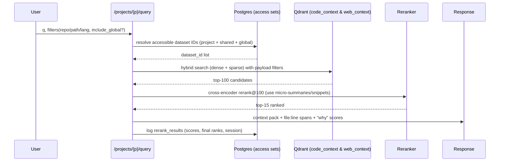

Sweet—time to turn your hybrid idea into a ship-ready plan. Below is a fully-fleshed blueprint with milestones, schemas, API surfaces, evaluation, and ops. I’ve also included Mermaid diagrams so you can *see* the data flow and the per-project isolation model. I’ve grounded the plan in the structures you already have in your repo (web crawl tables, dual-vector chunking, vector metadata, rerank logs, project isolation & shares), with citations so you can cross-check fast.

---

# Upgrade Plan: Hybrid Retrieval with Qdrant, Summaries, Reranking, Crawl4AI, and Per-Project Knowledge Bases

## 0) What you’re building (in one breath)

A **project-scoped context engine** that ingests code (GitHub) and web content (Crawl4AI), creates **content + summary + sparse** representations, stores them in **Qdrant** (named vectors + sparse), **filters by project** at query time, runs **hybrid top-K → cross-encoder rerank**, and returns citations with exact spans. Your DB already has the important pieces: web crawl schema, `chunks` with dual-vector IDs, **`vector_metadata`**, **`rerank_results`**, and a **projects + sharing** model that isolates datasets and lets you mark or share global content.

---

# 1) Architecture

### 1.1 High-level dataflow

```mermaid
flowchart LR
  subgraph GH[GitHub]
    GH0[Webhook: push@sha]
  end

  subgraph C4AI[Crawl4AI]
    C0[seed URL(s)]
  end

  GH0 --> I[Ingest Orchestrator]
  C0 --> I

  I --> CK[Chunkers]
  CK --> SUM[Summarizer (micro + macro)]
  CK --> EMB[Embedder: dense + sparse + summary]
  SUM --> Q[Qdrant: named vectors + sparse]
  EMB --> Q
  CK --> O[(Object Store):::store]  %% macros, blobs
  SUM --> O

  I --> PG[(Postgres Orchestrator DB)]
  Q --> R[Retriever API]
  PG --> R

  R --> H[Hybrid Search (dense+sparse)]
  H --> RE[Cross-Encoder Rerank]
  RE --> CP[Context Pack + Evidence]
  CP --> OUT[(Answer + Snippets + Why)]
  
  classDef store fill:#f5f5f5,stroke:#999,color:#333
```

**Why this works with your repo today:**

* **Dual-vector chunks + Qdrant metadata:** you already track `summary_vector_id`, store vector IDs and payload snapshots in **`vector_metadata`**, and log rerank scores in **`rerank_results`**.
* **Crawl4AI integration:** `web_pages`, `crawl_sessions`, views for monitoring, and helper funcs are in place.

---

### 1.2 Project isolation & sharing

You wanted each **Project** to be its own “knowledge island,” with optional bridges for shared/global content. Your migration does exactly that: **`projects`**, `project_id` on datasets, **`is_global` flags**, **`project_shares`**, and **views** (`project_statistics`, updated `dataset_statistics`).

```mermaid
graph TD
  P1[Project A] -->|owns| D1[Datasets A*]
  P2[Project B] -->|owns| D2[Datasets B*]
  G[Global]:::g -->|is_global| Dg[Global Datasets]
  P1 -. shares via project_shares .-> D2
  P2 -. shares via project_shares .-> D1
  P1 -->|query filter| Q[(Qdrant points with payload.project_id in {A} ∪ shared ∪ global)]
  classDef g fill:#eef8ff,stroke:#3b82f6,color:#1e3a8a
```

**Repo grounding:** tables, views, and helper functions are defined for projects, shares, and access checks; defaults create **`default`** and **`global`** projects out of the box.

---

# 2) Collections, Payloads, and Indexing

### 2.1 Qdrant collections

* **Collections**: start with two—`code_context`, `web_context`.
* **Vectors (named)**:

  * `content_dense`: main embedding (e.g., 768/1024).
  * `summary_dense`: embedding of micro-summary (≤256 tokens).
  * `sparse`: BM25/SPLADE-like CSR payload for lexical boost.
* **Payload (minimal, fast-filtering)**:
  `project_id`, `dataset_id`, `source_type (code|web_page|doc)`, `repo|sha|relpath|lang` **or** `url|domain`, `chunk_index`, `symbol`, `summary_256`.

You already keep vector IDs and metadata in **`vector_metadata`** (model, dim, payload snapshot, rerank score) and can index by `vector_type`/`collection_name`.

### 2.2 Postgres source of truth

Use your orchestrator DB for:

* **Crawl sessions** & monitoring
* **Chunks** with **content+summary vector IDs** and unique constraints for web/doc paths
* **Re-rank logs** for evaluation (query text, vector/bm25/rerank scores, final ranks, session IDs)
* **Project isolation** (`projects`, `project_shares`, project-aware views).

---

# 3) Pipelines

### 3.1 GitHub ingest (diff-first)

1. **Webhook** `push@sha` → enqueue `repo.index@sha`.
2. **Diff** changed files.
3. **Chunk** (tree-sitter/ctags) on **symbol boundaries**; compute `content_hash`.
4. **Summarize**: micro (≤256 tok) + file macro (store macro in object store, link in payload/DB).
5. **Embed**: `content_dense`, `summary_dense`, plus **sparse terms**.
6. **Upsert** to Qdrant with **project payloads**; record point IDs in **`vector_metadata`**.
7. **Write** `chunks` row with `vector_id`, `summary_vector_id`; keep `rerank_results` empty until query.

### 3.2 Crawl4AI ingest (project-aware)

* Use **`web_pages`** for content + metadata; **`crawl_sessions`** to track jobs and metrics.
* Upsert pages via your **`upsert_web_page_v3(project, dataset, ...)`** helper to attach them to the right project; it auto-creates the project/dataset if needed.
* Chunk → summarize → embed → upsert to Qdrant; write vector IDs to **`vector_metadata`** and chunks to **`chunks`**.

### 3.3 Event bus (bi-directional async)

Each stage emits events: `file.changed`, `chunk.created`, `chunk.summarized`, `vector.upserted`, `crawl.completed`, `query.issued`, `rerank.logged`.
Use idempotency keys like `source:sha:relpath:chunk_index:content_hash`. Your schema already logs and views by sessions; plug those IDs in for traceability.

---

# 4) Retrieval Algorithm



**Filters & access:** The access set expands to *this project* ∪ *explicit shares* ∪ *global content* (your `is_global` flags + `project_shares` cover this).
**Rerank logs:** Persist scores & ranks to **`rerank_results`** so you can compute MRR/nDCG over time.

---

# 5) API Surface (minimal but complete)

* `POST /projects/{name}/ingest/github` → `{ repo, sha, branch }`
* `POST /projects/{name}/ingest/crawl` → `{ start_url, crawl_type, depth, max_pages, dataset }` (tracks in **`crawl_sessions`**)
* `POST /projects/{name}/query` → `{ q, repo?, path_prefix?, lang?, include_global=true, k=100 }`
* `POST /projects/{name}/share` → calls **`share_resource`** to expose specific datasets/docs/pages to another project
* `GET /projects/{name}/stats` → joins **`project_statistics`**, `dataset_statistics`, and `crawl_session_summary`.

---

# 6) Data Model Additions (surgical)

You already added the key columns for web & dual vectors in **`chunks`** and have **unique constraints** per document or page. If not present, add fast filters for code provenance:

* `repo TEXT, branch TEXT, sha TEXT, relpath TEXT, lang TEXT, symbol JSONB, content_hash TEXT`
* Indexes: `(repo, sha)`, `(relpath)`, `(lang)`, and a **unique** `(document_id|web_page_id, chunk_index, content_hash)`.

Vector bookkeeping is already handled by **`vector_metadata`**, including model, dimension, and a Qdrant payload snapshot for quick introspection.

---

# 7) Summaries

* **Micro-summary** (≤256 tokens) per chunk, stored inline (payload `summary_256` and `chunks.summary`).
* **Macro** per file and per repo (store in object storage; keep a reference in DB).
* Use micro for **routing & rerank text**, macro for **context packing** when multiple chunks from same file are chosen.

---

# 8) Evaluation & Tuning

* Ground truth: build ~50–100 “real” queries (how-to, where-is, why-broke).
* Run A/B: pgvector-baseline vs Qdrant hybrid → **log** vector/bm25/rerank scores into **`rerank_results`** and compute **MRR@10 / nDCG@10**.
* Track **latency p50/p95** at:

  1. Qdrant search (top-100)
  2. Cross-encoder rerank
  3. End-to-end API
* Knobs: candidate K (50→100), α for fusion (or RRF), and per-project filter breadth (project-only vs project+global).

---

# 9) Security & Access

* Enforce “project visibility” in **SQL first** (resolve accessible dataset_id set) → pass **only those IDs** into Qdrant filters.
* Before returning a context, **re-check access** using your **`is_resource_accessible(project, type, id)`** function.
* Keep **global** content in the `global` project; share tactical datasets via **`project_shares`**.

---

# 10) Sizing & Ops

* **Qdrant**: snapshots nightly; WAL on; `memmap_threshold` tuned for large collections.
* **Payload discipline**: keep payloads tiny; store full blobs/macros in object store.
* **Cache**: query → top-M (2–5 minutes) to amortize rerank on repeated questions.
* **Dashboards**: use **`project_statistics`**, **`dataset_statistics`**, **`crawl_session_summary`** for ingest coverage and crawl health.

---

# 11) Phased Milestones (with concrete deliverables)

### Phase A — **Project-aware ingest & storage (2–3 days)**

* Wire ingest endpoints to require `project` name.
* Use **`get_or_create_project`** to create/resolve the project on write paths.
* Crawl4AI: switch to **`upsert_web_page_v3(project, dataset, …)`**; verify new pages appear in **`web_pages`** with correct project/dataset.
* GitHub indexer: tag chunks with `project_id` (via dataset) and **provenance** columns.
* Metrics: `project_statistics` shows datasets/pages/chunks by project.

**Exit criteria:** project-scoped data visible in stats views; old queries still work with project default.

---

### Phase B — **Qdrant collections & hybrid search (2 days)**

* Create `code_context` & `web_context` with **named vectors + sparse**.
* Upsert content+summary+sparse vectors; write **`vector_metadata`** rows.
* Implement hybrid search (dense + sparse) using payload filters for the **accessible set** (project ∪ shares ∪ global).

**Exit criteria:** `/projects/{p}/query` returns top-100 candidates with consistent filters.

---

### Phase C — **Rerank + context packing (1–2 days)**

* Add cross-encoder rerank@100; log **`rerank_results`** (query text, vector/bm25/rerank scores, final ranks).
* Implement macro-aware context packing (merge adjacent spans, include macro once).
* Return “**why**” evidence (scores + file:line spans + project/dataset IDs).

**Exit criteria:** measurable MRR uplift (>+15%) on gold set; p95 stays under target.

---

### Phase D — **Crawl observability & sharing UX (1 day)**

* Surface **`crawl_session_summary`** to UI; show success rate/durations.
* Implement `/projects/{from}/share` using `share_resource` with audit metadata.

**Exit criteria:** admins can share datasets across projects; crawl sessions monitored per project.

---

### Phase E — **Hardening & evaluation (ongoing)**

* Nightly snapshot/restore drills.
* Expand gold set; track MRR/nDCG weekly from **`rerank_results`**.
* Optional: add a **graph-lite adjacency table** (callers/imports) to nudge scores; graduate to Neo4j later if needed.

---

# 12) Concrete Implementation Notes

* **Project filter resolver (SQL sketch):**

  * Build `accessible_dataset_ids` = `{project_id} ∪ {datasets with is_global} ∪ {datasets shared via project_shares}` using your helper funcs/views.
* **Qdrant filter:**

  * `must`: `dataset_id ∈ accessible_dataset_ids` (and optional `repo/path/lang`), then hybrid search.
* **Rerank logging:** After final ranking, insert rows into **`rerank_results`** with `search_session_id` for grouped analysis.
* **Crawl health:** use `crawl_sessions.status`, `pages_crawled`, `pages_failed` to drive alerts/dashboards.

---

# 13) Mermaid: Component map (service view)

```mermaid
graph LR
  subgraph Ingestion
    W[Webhook Receiver]
    GIX[Git Indexer]
    CIX[Crawl4AI Worker]
    CH[Chunkers (AST/Docs)]
    SM[Summarizer]
    EM[Embedder]
  end

  subgraph Storage
    PG[(Postgres: projects, datasets, web_pages, chunks, vector_metadata, rerank_results)]
    QD[(Qdrant: code_context, web_context)]
    OS[(Object Store: macros, blobs)]
  end

  subgraph API
    QRY[/Query API/]
    ADM[/Admin API/]
  end

  W-->GIX-->CH-->SM-->EM-->QD
  CIX-->CH
  CH-->PG
  SM-->OS
  QRY-->PG
  QRY-->QD
  QRY-->OS
  ADM-->PG
```

---

# 14) Success metrics & expected deltas

* **Latency**: search top-100 **1.5–4× faster** than pgvector-only at similar scale; end-to-end **~2× faster** with CPU rerank.
* **Quality**: **+15–35% MRR@10/nDCG@10** once rerank + micro-summaries are in play.
* **Isolation**: Zero cross-project leakage; global datasets queryable everywhere by flag; explicit shares logged and revocable.

---

# 15) Ops playbook (abridged)

* **Backups**: Postgres daily + Qdrant snapshots daily; restore test weekly.
* **Idempotency**: keys = `source:sha:relpath:chunk_index:content_hash`.
* **Reindex strategy**: only chunks with changed `content_hash`; web pages dedup by `url + content_hash`.
* **Monitoring**: p50/p95 latency, error rates, Qdrant RAM usage, crawl success rate from `crawl_session_summary`.

---

## Final word

You’re not bolting on features; you’re evolving into a **project-native, hybrid search engine** with clean provenance and reproducible answers. The repo already carries the bones—web crawl schema, vector metadata, rerank logs, and project sharing. This plan simply tightens the screws and adds the hybrid brain.

When you’re ready, we can draft the exact `/projects/{p}/query` handler (hybrid + rerank) and a Qdrant collection bootstrapper, wired to your `vector_metadata` and `rerank_results` tables for instant observability.
